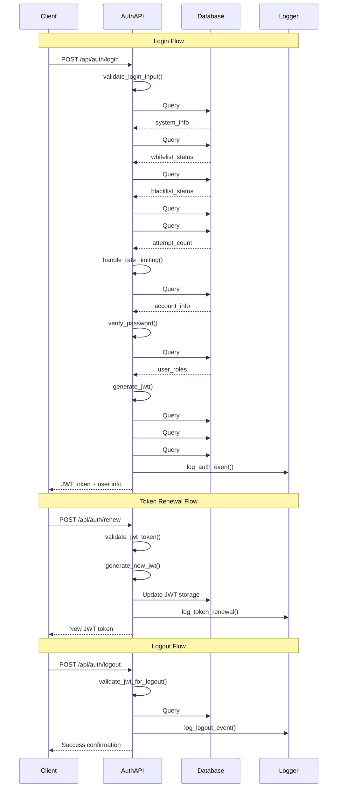
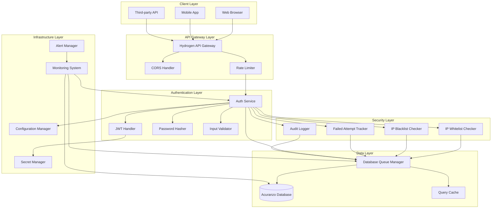
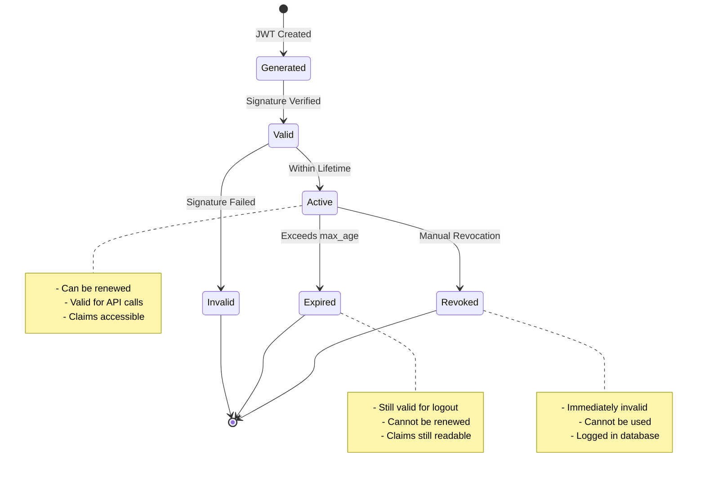

# AUTH ENDPOINTS - ARCHITECTURE DIAGRAMS

## Authentication Flow Diagram



## System Architecture Diagram



## JWT Lifecycle Diagram



## Deployment Architecture Diagram

```mermaid
graph TB
    subgraph "Development"
        DevRepo[Git Repository]
        DevBuild[Build Pipeline]
        DevTest[Test Environment]
    end

    subgraph "Staging"
        StagingK8s[Kubernetes Cluster]
        StagingDB[(Staging Database)]
        StagingSecrets[Secret Management]
    end

    subgraph "Production (DOKS)"
        ProdK8s[Kubernetes Cluster]
        ProdDB[(Production Database)]
        ProdSecrets[Secret Management]
        LoadBalancer[Load Balancer]
        CDN[CDN]
    end

    subgraph "Monitoring"
        Prometheus[Prometheus]
        Grafana[Grafana]
        AlertManager[Alert Manager]
        ELK[ELK Stack]
    end

    DevRepo --> DevBuild
    DevBuild --> DevTest
    DevTest --> StagingK8s

    StagingK8s --> StagingDB
    StagingK8s --> StagingSecrets

    StagingK8s --> ProdK8s

    ProdK8s --> ProdDB
    ProdK8s --> ProdSecrets
    ProdK8s --> LoadBalancer
    LoadBalancer --> CDN

    ProdK8s --> Prometheus
    ProdK8s --> ELK

    Prometheus --> Grafana
    Prometheus --> AlertManager
