# AUTH ENDPOINTS PLANNING REVIEW

**Reviewed By**: Kilo Code (Architect Mode)  
**Review Date**: 2026-01-08  
**Status**: ✅ Ready for Implementation

## Executive Summary

The authentication endpoints planning for Hydrogen is **comprehensive and well-documented**. The planning phase shows 100% completion with all major architectural, technical, and operational aspects thoroughly covered across 11 detailed planning documents.

**Overall Assessment**: ✅ **READY TO PROCEED** - All planning documents are in place and provide sufficient detail for implementation.

## Documents Reviewed

| Document | Lines | Status | Assessment |
| ---------- | ------- | -------- | ------------ |
| [`AUTH_PLAN.md`](/docs/H/plans/AUTH_PLAN.md) | 78 | ✅ Complete | Excellent TOC and navigation |
| [`AUTH_PLAN_API.md`](/docs/H/plans/AUTH_PLAN_API.md) | 267 | ✅ Complete | Comprehensive API specs with schemas |
| [`AUTH_PLAN_DIAGRAMS.md`](/docs/H/plans/AUTH_PLAN_DIAGRAMS.md) | 215 | ✅ Complete | Clear architecture diagrams |
| [`AUTH_PLAN_IMPLEMENTATION.md`](/docs/H/plans/AUTH_PLAN_IMPLEMENTATION.md) | 690 | ✅ Complete | Detailed pseudo-code for all functions |
| [`AUTH_PLAN_SECURITY.md`](/docs/H/plans/AUTH_PLAN_SECURITY.md) | 82 | ✅ Complete | Strong security measures |
| [`AUTH_PLAN_ERRORS.md`](/docs/H/plans/AUTH_PLAN_ERRORS.md) | 156 | ✅ Complete | Comprehensive error handling |
| [`AUTH_PLAN_TESTS.md`](/docs/H/plans/AUTH_PLAN_TESTS.md) | 1299 | ✅ Complete | Extensive test coverage strategy |
| [`AUTH_PLAN_INTEGRATION.md`](/docs/H/plans/AUTH_PLAN_INTEGRATION.md) | 123 | ✅ Complete | Clear subsystem integration |
| [`AUTH_PLAN_PERFORMANCE.md`](/docs/H/plans/AUTH_PLAN_PERFORMANCE.md) | 31 | ✅ Complete | Good performance considerations |
| [`AUTH_PLAN_ACURANZO.md`](/docs/H/plans/AUTH_PLAN_ACURANZO.md) | 399 | ✅ Complete | Detailed database integration |
| [`AUTH_PLAN_OPERATIONS.md`](/docs/H/plans/AUTH_PLAN_OPERATIONS.md) | 44 | ✅ Complete | Operational procedures defined |
| [`AUTH_PLAN_PROGRESS.md`](/docs/H/plans/AUTH_PLAN_PROGRESS.md) | 152 | ✅ Complete | Clear phase tracking |

## Strengths

### 1. **Architecture & Design** ✅

- Clear separation of concerns with modular endpoint structure
- Well-defined integration with existing Hydrogen subsystems (DQM, logging, config)
- Comprehensive sequence diagrams showing end-to-end flows
- Proper JWT lifecycle management with rotation support

### 2. **Database Integration** ✅

- **20 existing QueryRefs** already implemented (#001-#020)
- **3 new QueryRefs** identified for registration (#050-#052)
- Acuranzo database schema properly analyzed
- Performance indexes identified
- Clear SQL templates for all queries

### 3. **Security** ✅

- Rate limiting with configurable thresholds
- IP whitelist/blacklist support
- Comprehensive audit logging
- JWT signing with HMAC-SHA256 and RSA-SHA256 support
- Password hashing with account ID salt
- SQL injection protection via parameterized queries

### 4. **Testing Strategy** ✅

- Unity unit tests for all functions (Test 10)
- Blackbox integration tests (Test 40)
- Security testing scenarios
- Performance testing with load metrics
- Test coverage targets >85%
- CI/CD pipeline configuration defined

### 5. **Implementation Details** ✅

- Detailed pseudo-code for all authentication functions
- Clear function breakdown for testability
- Swagger documentation templates provided
- Error handling with structured responses
- Configuration management patterns defined

### 6. **Documentation Quality** ✅

- Clear TOC structure for navigation
- Consistent formatting across all documents
- Code examples in all sections
- Proper linking between related documents
- Markdown best practices followed

## Areas of Excellence

### API Specifications ([`AUTH_PLAN_API.md`](/docs/H/plans/AUTH_PLAN_API.md))

- **JSON schemas** for all request/response bodies
- **HTTP status codes** properly mapped
- **Validation rules** clearly defined
- **Authentication flows** broken into testable steps

**Example Quality**:

```json
// Request validation with min/max lengths
"login_id": {
  "type": "string",
  "minLength": 1,
  "maxLength": 255,
  "description": "Username or email address for authentication"
}
```

### Implementation Guide ([`AUTH_PLAN_IMPLEMENTATION.md`](/docs/H/plans/AUTH_PLAN_IMPLEMENTATION.md))

- **690 lines** of detailed pseudo-code
- Every function has implementation details
- JWT secret management with key rotation
- Multi-instance deployment considerations
- Clear code structure matching Hydrogen patterns

**Example Quality**:

```c
// Clear function signature and logic
bool verify_api_key(const char* api_key, system_info_t* sys_info) {
    query_result_t result = execute_query(1, json_object({
        "api_key": api_key
    }));
    // ... implementation details ...
}
```

### Database Integration ([`AUTH_PLAN_ACURANZO.md`](/docs/H/plans/AUTH_PLAN_ACURANZO.md))

- Complete mapping of existing QueryRefs
- SQL templates for new queries
- Index optimization strategy
- Caching strategy defined
- Performance monitoring queries

### Testing ([`AUTH_PLAN_TESTS.md`](/docs/H/plans/AUTH_PLAN_TESTS.md))

- **1299 lines** of comprehensive test strategy
- Unit test examples with Unity framework
- Blackbox test scripts with bash examples
- Test data management strategy
- CI/CD pipeline YAML configuration

## Identified Gaps & Recommendations

### 1. Minor: Environment Variables Documentation

**Gap**: Environment variable requirements are listed in [`AUTH_PLAN.md`](/docs/H/plans/AUTH_PLAN.md) but not in [`INSTRUCTIONS.md`](/docs/H/INSTRUCTIONS.md)

**Recommendation**: Add auth environment variables to project setup documentation

**Priority**: Low

**Suggested Variables**:

```bash
export HYDROGEN_JWT_SECRET="your-256-bit-secret-here"
export HYDROGEN_AUTH_ENABLED="true"
export HYDROGEN_AUTH_MAX_FAILED_ATTEMPTS="5"
export HYDROGEN_AUTH_RATE_LIMIT_WINDOW="15"
export HYDROGEN_AUTH_IP_BLOCK_DURATION="15"
export HYDROGEN_AUTH_ENABLE_REGISTRATION="true"
```

### 2. Minor: Migration File Names

**Gap**: [`AUTH_PLAN_ACURANZO.md`](/docs/H/plans/AUTH_PLAN_ACURANZO.md) references migrations 1141-1143, but doesn't specify the Lua filename format

**Recommendation**: Confirm migration naming follows existing Acuranzo patterns

**Priority**: Low

**Expected Format**: `acuranzo_1141.lua`, `acuranzo_1142.lua`, `acuranzo_1143.lua`

### 3. Minor: CORS Configuration

**Gap**: [`AUTH_PLAN_INTEGRATION.md`](/docs/H/plans/AUTH_PLAN_INTEGRATION.md) mentions CORS headers but doesn't detail allowed origins

**Recommendation**: Define default CORS policy for auth endpoints

**Priority**: Low

**Suggested Default**:

```json
{
  "auth": {
    "allowed_origins": ["https://app.example.com", "http://localhost:3000"],
    "allowed_methods": ["POST", "OPTIONS"],
    "max_age": 86400
  }
}
```

### 4. Minor: Test 40 Script Name

**Gap**: Integration test is referenced as "Test 40" but script name not confirmed

**Recommendation**: Verify the script will be named `test_40_auth.sh` following existing patterns (test_21_system_endpoints.sh, test_22_swagger.sh, etc.)

**Priority**: Low

### 5. Clarification: QueryRef Parameter Order

**Gap**: QueryRef SQL templates show `?` placeholders but don't always specify parameter order

**Recommendation**: Add explicit parameter order comments to all QueryRef SQL templates

**Priority**: Low

**Example Enhancement**:

```sql
-- QueryRef #050: Check username/email availability
-- Parameters: 1=username, 2=email
SELECT
    COUNT(*) as username_count,
    (SELECT COUNT(*) FROM accounts WHERE email = ?) as email_count
FROM accounts
WHERE username = ?
```

## Readiness Assessment

### ✅ Ready Components

| Component | Status | Notes |
| ----------- | -------- | ------- |
| Architecture | ✅ Ready | Clear diagrams and flow |
| API Specifications | ✅ Ready | Complete schemas |
| Database Schema | ✅ Ready | 20 existing + 3 new QueryRefs |
| Security Design | ✅ Ready | Comprehensive measures |
| Testing Strategy | ✅ Ready | Detailed test plans |
| Error Handling | ✅ Ready | Structured responses |
| Implementation Pseudo-code | ✅ Ready | All functions defined |
| Integration Patterns | ✅ Ready | Clear subsystem integration |

### ⚠️ Needs Minor Clarification (Non-Blocking)

| Item | Document | Severity | Can Proceed? |
| ------ | ---------- | ---------- | -------------- |
| Environment variables in INSTRUCTIONS.md | AUTH_PLAN.md | Low | ✅ Yes |
| CORS default policy | AUTH_PLAN_INTEGRATION.md | Low | ✅ Yes |
| Migration file names | AUTH_PLAN_ACURANZO.md | Low | ✅ Yes |
| QueryRef parameter order | AUTH_PLAN_ACURANZO.md | Low | ✅ Yes |
| Test 40 script name | AUTH_PLAN_TESTS.md | Low | ✅ Yes |

## Implementation Readiness Checklist

### Phase 3: Core Implementation (Next Phase)

Based on [`AUTH_PLAN_PROGRESS.md`](/docs/H/plans/AUTH_PLAN_PROGRESS.md), you're ready to start Phase 3:

- [ ] Create [`src/api/auth/auth_service.h`](/elements/001-hydrogen/hydrogen/src/api/auth/auth_service.h) header
- [ ] Create [`src/api/auth/auth_service.c`](/elements/001-hydrogen/hydrogen/src/api/auth/auth_service.c) implementation
- [ ] Implement validation functions
- [ ] Implement JWT functions
- [ ] Implement password functions
- [ ] Implement security functions
- [ ] Create unit tests

### Prerequisites Verified

- ✅ Database QueryRefs (#001-#020) exist in Acuranzo
- ✅ Database tables (accounts, tokens, licenses, lists) exist
- ✅ DQM (Database Queue Manager) is operational
- ✅ JWT library integration exists in Hydrogen
- ✅ API framework patterns are established
- ✅ Logging system (SR_AUTH) can be added
- ✅ Configuration system supports auth section

## Recommendations for Implementation

### 1. Start with Core Utilities

Begin with [`auth_service.c`](/elements/001-hydrogen/hydrogen/src/api/auth/auth_service.c) shared utilities:

```c
// Priority order:
1. validate_login_input()
2. validate_timezone()
3. hash_password()
4. verify_password()
5. generate_jwt()
6. validate_jwt()
```

### 2. Add QueryRef Migrations First

Before implementing endpoints, add the 3 new QueryRefs:

1. `acuranzo_1141.lua` - QueryRef #050 (check username/email)
2. `acuranzo_1142.lua` - QueryRef #051 (create account)
3. `acuranzo_1143.lua` - QueryRef #052 (update password)

### 3. Implement Endpoints in Order

Follow this sequence for endpoint implementation:

1. **Login** - Most critical, uses existing QueryRefs
2. **Logout** - Simple, uses existing QueryRef #019
3. **Renew** - Moderate complexity, JWT validation
4. **Register** - Last, uses new QueryRefs #050-#052

### 4. Test as You Go

Run `mkt` after each C file change:

```bash
# From any directory
mkt  # Test build (minimal output)

# If successful
mka  # Build all targets

# For unit tests
mku test_auth_service  # Run specific test
```

## Summary of Review Findings

### ✅ What You Have

1. **Complete architectural design** with sequence diagrams
2. **Detailed API specifications** with JSON schemas
3. **690 lines of pseudo-code** for implementation
4. **1299 lines of testing strategy** with examples
5. **20 existing database QueryRefs** ready to use
6. **Clear integration patterns** with existing subsystems
7. **Comprehensive security measures** defined
8. **Operational procedures** documented

### ⚠️ What You Should Clarify (Optional)

1. Add auth environment variables to [`INSTRUCTIONS.md`](/docs/H/INSTRUCTIONS.md)
2. Confirm migration file naming convention
3. Define default CORS policy
4. Add parameter order comments to SQL templates
5. Confirm Test 40 script name

### 🎯 What You Can Start Implementing

**Phase 3: Core Implementation** - All prerequisites are met:

1. Create auth service header and implementation files
2. Implement utility functions (validation, JWT, password)
3. Create unit tests for each function
4. Add 3 new QueryRef migrations
5. Test database integration

## Conclusion

**Status**: ✅ **READY FOR IMPLEMENTATION**

The authentication endpoints planning is comprehensive, well-structured, and provides all necessary detail for implementation. The minor gaps identified are clarifications that can be addressed during implementation and don't block progress.

**Confidence Level**: **High** (95%)

**Recommendation**: **Proceed to Phase 3 (Core Implementation)**

All planning documents are complete and aligned with Hydrogen's existing architecture, coding standards, and best practices. The implementation can begin immediately following the phased approach outlined in [`AUTH_PLAN_PROGRESS.md`](/docs/H/plans/AUTH_PLAN_PROGRESS.md).

## Review Diagram

```mermaid
graph TD
    A[Planning Review] --> B{Documentation Complete?}
    B -->|Yes| C[✅ All 11 Docs Present]
    C --> D{Technical Details Sufficient?}
    D -->|Yes| E[✅ Pseudo-code + Schemas]
    E --> F{Database Ready?}
    F -->|Yes| G[✅ 20 QueryRefs Exist]
    G --> H{Integration Clear?}
    H -->|Yes| I[✅ Patterns Defined]
    I --> J{Testing Planned?}
    J -->|Yes| K[✅ Comprehensive Strategy]
    K --> L[✅ READY TO PROCEED]
    
    style L fill:#90EE90
    style C fill:#90EE90
    style E fill:#90EE90
    style G fill:#90EE90
    style I fill:#90EE90
    style K fill:#90EE90
```



## Next Steps

1. **Review this assessment** with your team
2. **Address minor clarifications** if desired (optional, non-blocking)
3. **Switch to Code mode** to begin implementation
4. **Start with Phase 3** from [`AUTH_PLAN_PROGRESS.md`](/docs/H/plans/AUTH_PLAN_PROGRESS.md)
5. **Follow the implementation order** recommended above

---

**Review Completed**: 2026-01-08  
**Reviewer**: Kilo Code (Architect Mode)  
**Recommendation**: ✅ **PROCEED TO IMPLEMENTATION**
