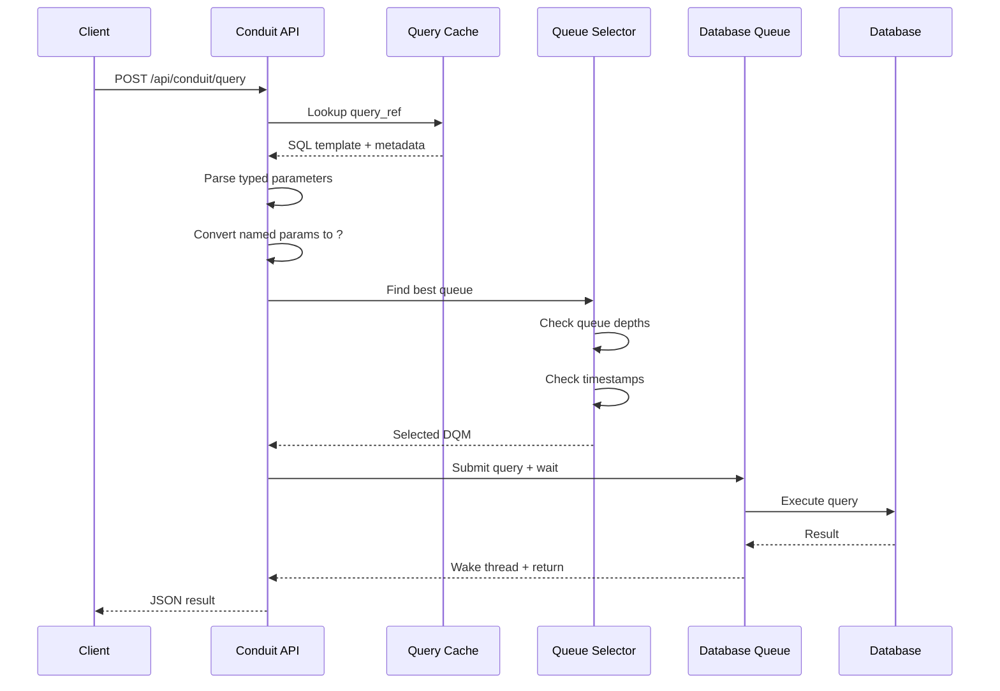
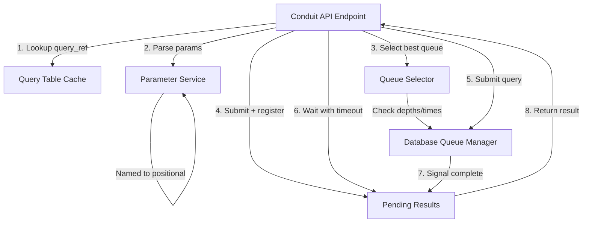
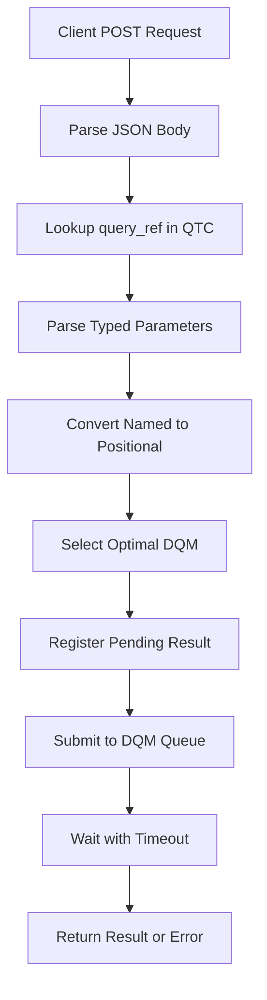
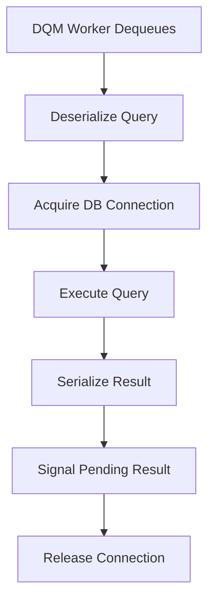
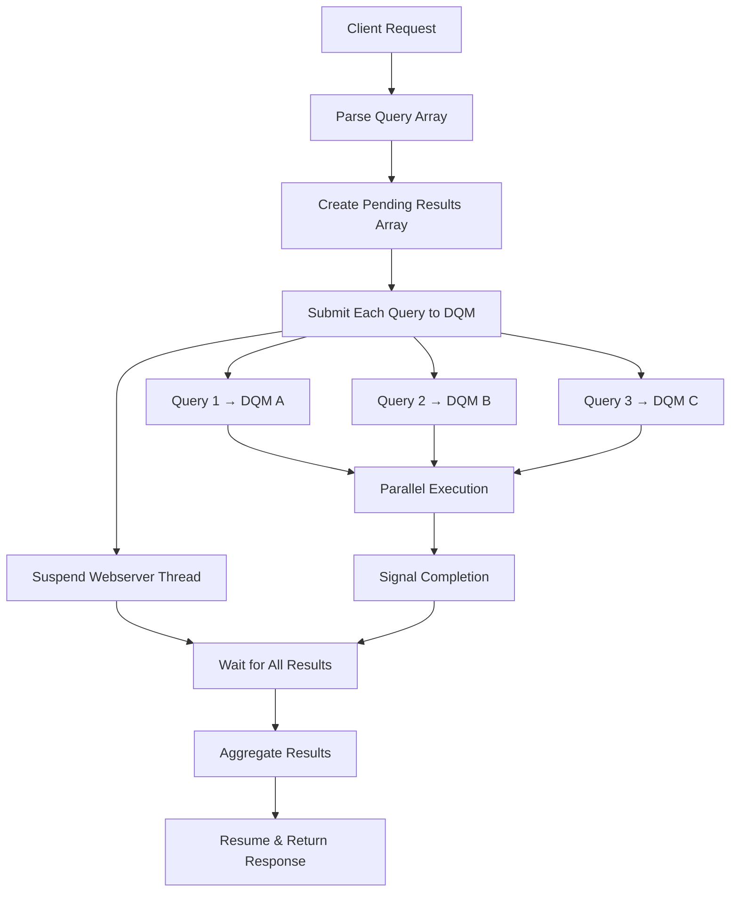

# Conduit Service Architecture Diagrams

## Query Endpoint Flow (Desired Implementation)

### Detailed Flow Description

Request arrives at `/api/conduit/query` endpoint. Assume `"success": false` and `"message": ""` to start with.

#### (A) Check JSON

- Parse incoming JSON request body
- If JSON is malformed or unparseable, return HTTP 400 with detailed message about JSON parsing error
- This happens at the API level to catch obviously invalid requests early

#### (B) Validate Params

- If request contains parameters, validate that supplied parameter types match their declared types
- INTEGER params must be integers, STRING params must be strings, etc.
- If type mismatch detected, return HTTP 400 with message like "Numerator(INTEGER) is not INTEGER"
- Skip validation if no parameters provided

#### (C) Locate Query in QTC

- Lookup database using provided database name
- If database not found or not configured, return HTTP 400 with message indicating database issue
- Lookup query by query_ref in Query Table Cache
- If query not found, return HTTP 400 with message indicating query not found
- If query exists but query_type_a28 ≠ 10 (not public), return HTTP 400 with message indicating query not public

#### (D) Assign Parameters

- Parse provided parameters into typed parameter list
- Convert named parameters (:userId) to database-specific positional format ($1, ?, etc.)
- Check for missing required parameters (named params in SQL that weren't provided)
- If missing parameters found, return HTTP 400 with message listing missing parameters
- Check for unused provided parameters (provided but not in SQL template)
- If unused parameters found, add warning to message but continue processing (don't fail)

#### (E) Execute Query

- Select optimal database queue based on query requirements
- Generate unique query ID and register pending result
- Submit query to Database Queue Manager
- Wait for execution with timeout
- If database errors occur during execution, return HTTP 429 with database error message prepended to existing message
- If execution succeeds, return HTTP 200 with `"success": true`, result data, and any accumulated message (unused params, etc.)

### Key Design Principles

1. **Fail Fast on Invalid Input**: Reject malformed requests before consuming database resources
2. **Verbose Error Messages**: Every 400 error includes clear explanation of what went wrong
3. **Allow Unused Parameters**: Don't fail on extra parameters, just warn in message
4. **Protect Database Resources**: Never query database until all validation passes
5. **Clear Success/Failure**: Response always includes boolean `success` and descriptive `message`

### Mermaid Flow Diagram

```mermaid
flowchart TD
    A[HTTP POST /api/conduit/query] --> B[(A) Check JSON]
    B --> C{Valid JSON?}
    C -->|No| D[HTTP 400: Invalid JSON<br/>+ detailed error message]
    C -->|Yes| E[(B) Validate Params]

    E --> F{Has params<br/>and types match?}
    F -->|Type mismatch| G[HTTP 400: Parameter type mismatch<br/>e.g., "userId(INTEGER) is not INTEGER"]
    F -->|Valid/No params| H[(C) Locate Query in QTC]

    H --> I{Database<br/>found?}
    I -->|No| J[HTTP 400: Database not found<br/>+ database error message]
    I -->|Yes| K{Query found<br/>query_type_a28 = 10?}
    K -->|No| L[HTTP 400: Query not found/public<br/>+ query error message]
    K -->|Yes| M[(D) Assign Parameters]

    M --> N{Missing<br/>required params?}
    N -->|Yes| O[HTTP 400: Missing parameters<br/>+ list of missing params]
    N -->|No| P{Check unused<br/>params?}

    P --> Q[Log warning for unused<br/>add to message]
    Q --> R[(E) Execute Query]

    R --> S{Database<br/>errors?}
    S -->|Yes| T[HTTP 429: Database error<br/>+ error message + existing message]
    S -->|No| U[HTTP 200: Success<br/>success: true<br/>+ data + message]
```

## Request Flow Architecture



## Component Architecture



## Request Processing Flow



## DQM Processing Flow



## Parallel Query Execution for Multiple Endpoints



## Webserver Resource Suspension

```mermaid
stateDiagram-v2
    [*] --> RequestReceived
    RequestReceived --> ParseRequest
    ParseRequest --> SubmitQueries
    SubmitQueries --> SuspendThread: Free webserver resources
    SuspendThread --> WaitForResults: Block on condition variables
    WaitForResults --> CheckTimeouts: Periodic timeout checks
    CheckTimeouts --> ResultsReady: All queries complete
    CheckTimeouts --> TimeoutError: Timeout exceeded
    ResultsReady --> ResumeThread: Reacquire webserver resources
    TimeoutError --> ResumeThread
    ResumeThread --> FormatResponse
    FormatResponse --> [*]