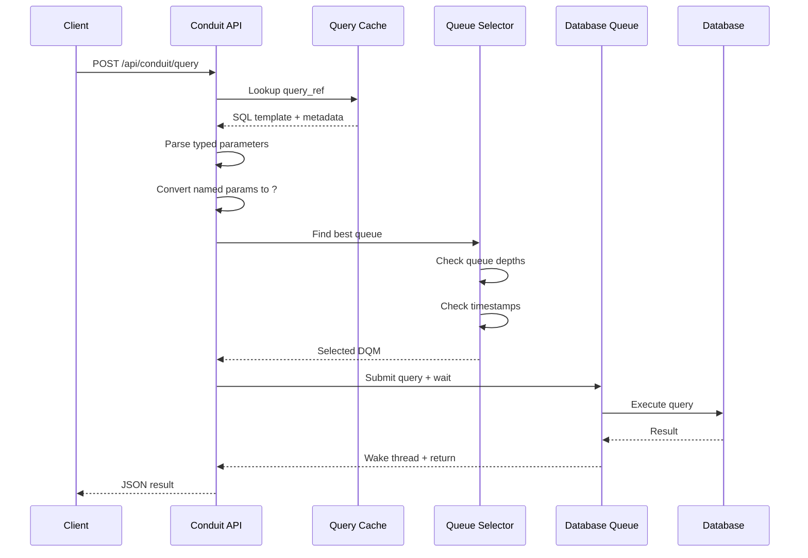
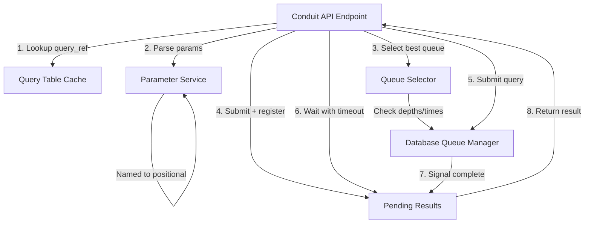
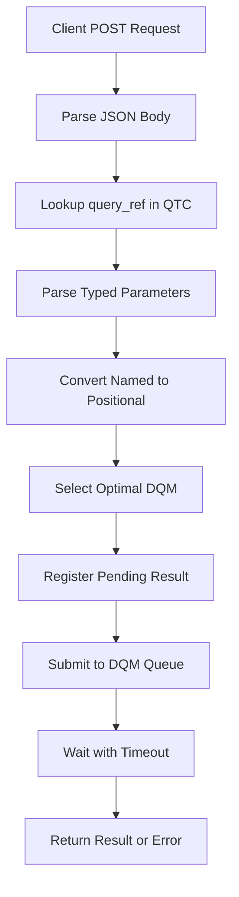
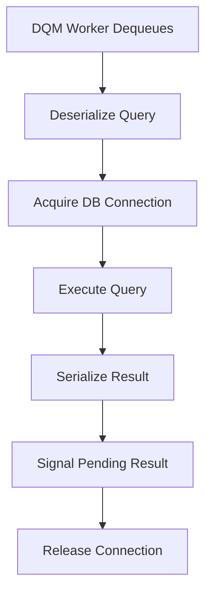
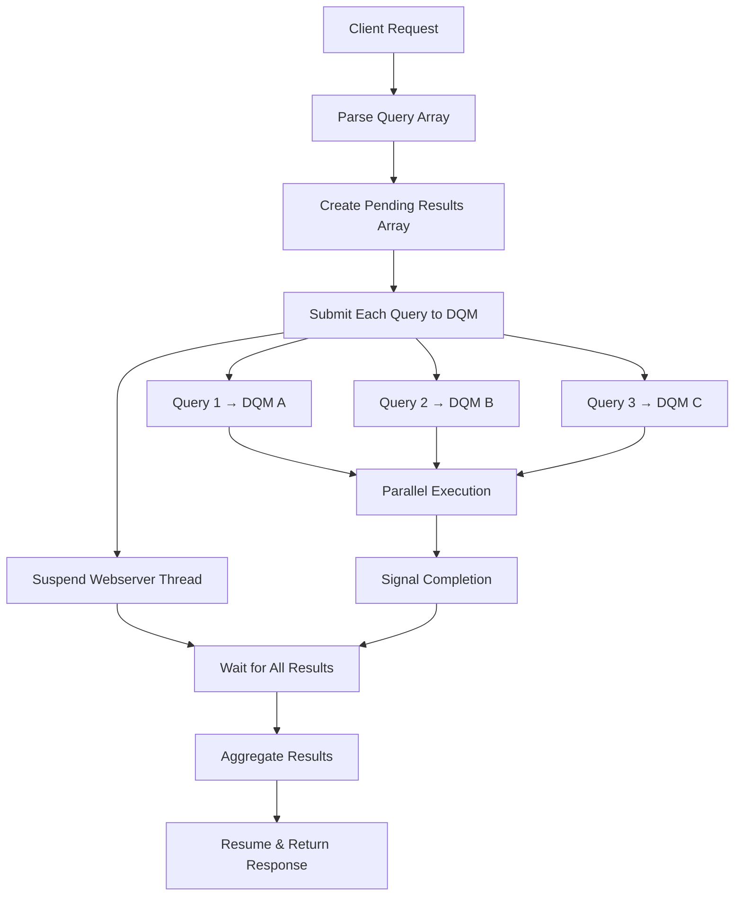

# Conduit Service Architecture Diagrams

## Request Flow Architecture



## Component Architecture



## Request Processing Flow



## DQM Processing Flow



## Parallel Query Execution for Multiple Endpoints



## Webserver Resource Suspension

```mermaid
stateDiagram-v2
    [*] --> RequestReceived
    RequestReceived --> ParseRequest
    ParseRequest --> SubmitQueries
    SubmitQueries --> SuspendThread: Free webserver resources
    SuspendThread --> WaitForResults: Block on condition variables
    WaitForResults --> CheckTimeouts: Periodic timeout checks
    CheckTimeouts --> ResultsReady: All queries complete
    CheckTimeouts --> TimeoutError: Timeout exceeded
    ResultsReady --> ResumeThread: Reacquire webserver resources
    TimeoutError --> ResumeThread
    ResumeThread --> FormatResponse
    FormatResponse --> [*]