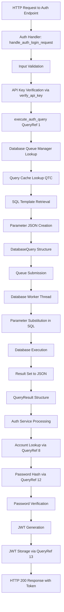

# Test 40 Authentication Debugging Plan

## Executive Summary

Test 40 is failing consistently across all database engines (PostgreSQL, SQLite, DB2, MySQL) with login, invalid credentials, and registration failures. The simultaneous failure across all engines indicates a common infrastructure problem in the database query execution pipeline rather than engine-specific issues.

## Test 40 Overview

**Test:** [`test_40_auth.sh`](/elements/001-hydrogen/hydrogen/tests/test_40_auth.sh)

**Purpose:** Comprehensive authentication endpoint testing across multiple database engines

**Endpoints Tested:**

- `POST /api/auth/login` - User login with JWT token return
- `POST /api/auth/renew` - JWT token renewal
- `POST /api/auth/logout` - JWT token invalidation
- `POST /api/auth/register` - User registration

**Current Status:** All tests failing on all engines

## Database Query Flow Architecture



## Critical Components to Investigate

### 1. Database Bootstrap & QTC Population

**File:** [`database_bootstrap.c`](/elements/001-hydrogen/hydrogen/src/database/database_bootstrap.c)

**Bootstrap Query from Config:**

```sql
SELECT query_id id, query_ref ref, query_status_a27 status, 
       query_type_a28 type, query_dialect_a30 engine, 
       query_queue_a58 queue, query_timeout timeout, 
       name, code query 
FROM demo.queries 
WHERE (query_status_a27 = 1) 
ORDER BY query_type_a28 desc;
```

**What to Verify:**

- Does `demo.queries` table exist when bootstrap runs?
- Are migrations executed BEFORE bootstrap query?
- Are query records (QueryRef 1-51) inserted by migrations?
- Is Query Template Cache (QTC) populated successfully?
- Are there any bootstrap errors in logs?

**Expected QueryRefs for Auth:**

- QueryRef 1: Verify API Key
- QueryRef 4: Log Login Attempt
- QueryRef 5: Get Login Attempt Count
- QueryRef 7: Block IP Address
- QueryRef 8: Get Account ID
- QueryRef 12: Check Password
- QueryRef 13: Store JWT
- QueryRef 18: Validate JWT
- QueryRef 19: Delete JWT
- QueryRef 50: Check Username Availability
- QueryRef 51: Create Account

### 2. Query Execution Pipeline

**File:** [`auth_service_database.c`](/elements/001-hydrogen/hydrogen/src/api/auth/auth_service_database.c:32)

**Function:** `execute_auth_query(int query_ref, const char* database, json_t* params)`

**Critical Path Points:**

1. **Database Queue Lookup:**

   ```c
   DatabaseQueue* db_queue = database_queue_manager_get_database(global_queue_manager, database);
   ```

   - Is `global_queue_manager` initialized?
   - Does "Acuranzo" database queue exist?

2. **Query Cache Entry Lookup:**

   ```c
   const QueryCacheEntry* cache_entry = lookup_query_cache_entry(db_queue, query_ref);
   ```

   - Is QTC populated for this database?
   - Does QueryRef exist in cache?

3. **Parameter Serialization:**

   ```c
   char* params_json = json_dumps(params, JSON_COMPACT);
   ```

   - Is JSON valid?
   - Are all required parameters present?

4. **Query Submission:**

   ```c
   bool submit_success = database_queue_submit_query(db_queue, &db_query);
   ```

   - Does submission succeed?
   - Is queue accepting queries?

5. **Result Awaiting:**

   ```c
   const DatabaseQuery* result_query = database_queue_await_result(db_queue, query_id, 30);
   ```

   - Does query complete within timeout?
   - Is result structure valid?

6. **Result Parsing:**

   ```c
   result->data_json = strdup(result_query->parameter_json);
   ```

   - Is result JSON properly formatted?
   - Does calling code expect this format?

### 3. Environment Variables & Configuration

**Required Environment Variables:**

- `HYDROGEN_DEMO_API_KEY` - Must match migration 1145
- `HYDROGEN_DEMO_USER_NAME` - Must match migration 1144
- `HYDROGEN_DEMO_USER_PASS` - Must match migration 1144
- `HYDROGEN_DEMO_JWT_KEY` - For JWT signing
- Database credentials (ACURANZO_*, CANVAS_*, etc.)

**Configuration File:** [`hydrogen_test_40_postgres.json`](/elements/001-hydrogen/hydrogen/tests/configs/hydrogen_test_40_postgres.json)

**Key Settings:**

- AutoMigration: true
- Schema: demo
- Bootstrap: Query from demo.queries table

### 4. Database Migrations

**Migration 1144:** Demo user account creation

- Creates account record with environment variable credentials
- Must be executed before test runs
- Password must be hashed using account_id as salt

**Migration 1145:** Demo API key creation

- Creates system record with API key
- License expiry timestamp
- Must match `HYDROGEN_DEMO_API_KEY` environment variable

## Debugging Checklist

### Phase 1: Foundation Verification (Quick Wins)

- [ ] **Environment Variables**
  - Run `test_03_shell.sh` to verify all required env vars
  - Confirm variables match in both test script and migrations
  - Check that variables are exported to server process
  
- [ ] **Database Connection**
  - Verify databases are running (postgres, mysql, sqlite, db2)
  - Test connection strings manually
  - Check database user permissions
  
- [ ] **Server Startup Logs**
  - Review logs for bootstrap errors
  - Check for database connection failures
  - Look for QTC population messages
  - Verify subsystem launch order (Database before API)

- [ ] **Migration Execution**
  - Query `demo.queries` table directly - does it exist?
  - Check if QueryRef records exist (1,4,5,7,8,12,13,18,19,50,51)
  - Verify demo user account exists
  - Verify demo API key system record exists
  - Check account status (enabled=true, authorized=true)

### Phase 2: Component Isolation

- [ ] **Query Cache Testing**
  - Add logging to `lookup_query_cache_entry()`
  - Verify each required QueryRef is cached
  - Check SQL template content
  - Verify queue type and dialect fields
  
- [ ] **Database Queue Manager**
  - Verify `global_queue_manager` is not NULL
  - Check that `database_queue_manager_get_database()` returns valid queue
  - Confirm queue is initialized and ready
  - Check worker thread status
  
- [ ] **Parameter Serialization**
  - Test `json_dumps()` with sample parameters
  - Verify parameter names match SQL template placeholders
  - Check for NULL or invalid JSON
  
- [ ] **Simple Query Test**
  - Create standalone test for QueryRef 1 (API key verification)
  - Test with known good API key
  - Verify result structure
  - Check JSON parsing

- [ ] **Password Functions**
  - Test `compute_password_hash()` with known inputs
  - Verify hash format
  - Test `verify_password()` logic
  - Check account_id salt application

- [ ] **JWT Functions**
  - Test `generate_jwt()` with sample data
  - Verify token format
  - Test `compute_token_hash()`
  - Check JWT signing with HYDROGEN_DEMO_JWT_KEY

### Phase 3: End-to-End Tracing

- [ ] **Add Extensive Logging**
  - Instrument `execute_auth_query()` with debug logs
  - Log every step: queue lookup, cache lookup, submission, await
  - Log parameter JSON before submission
  - Log result JSON after receipt
  
- [ ] **Test Each QueryRef Individually**
  - QueryRef 1: API key verification
  - QueryRef 8: Account lookup
  - QueryRef 12: Password hash retrieval
  - QueryRef 51: Account creation
  - Verify each returns expected data structure
  
- [ ] **HTTP Request Tracing**
  - Use curl to manually test login endpoint
  - Check request body format
  - Verify response status and body
  - Compare to test script requests
  
- [ ] **Database Engine Comparison**
  - Test one engine at a time
  - Compare SQL dialects for each QueryRef
  - Check for engine-specific issues
  - Verify parameter substitution per engine

### Phase 4: Result Format Validation

- [ ] **QueryResult Structure**
  - Verify `success` flag is set correctly
  - Check `data_json` format matches expectations
  - Verify `error_message` on failures
  - Check `row_count` field
  
- [ ] **JSON Parsing in Callers**
  - Review how `lookup_account()` parses result JSON
  - Check `get_password_hash()` JSON parsing
  - Verify `verify_api_key()` extraction logic
  - Test with actual database result format
  
- [ ] **Database-Specific JSON Formats**
  - PostgreSQL: JSON array format
  - MySQL: JSON array format
  - SQLite: JSON array format
  - DB2: JSON array format
  - Verify all engines return compatible format

### Phase 5: Race Conditions & Timing

- [ ] **Bootstrap vs. Migration Order**
  - Verify migrations complete BEFORE bootstrap
  - Check if bootstrap can run on empty queries table
  - Add retry logic if needed
  
- [ ] **Queue Initialization**
  - Verify database subsystem launches before API
  - Check if API handlers wait for queues to be ready
  - Test with added delays to verify timing
  
- [ ] **Cache Population Timing**
  - Check when QTC is populated
  - Verify it's available when first query is made
  - Add synchronization if needed

## Diagnostic Tools to Create

### 1. Standalone Query Tester

Create a simple C program that:

- Initializes database subsystem
- Loads configuration
- Executes QueryRef 1 with test API key
- Prints full result structure
- Exits cleanly

### 2. Database Query Verification Script

Create a bash script that:

- Connects to each database engine
- Queries `demo.queries` table
- Verifies all required QueryRefs exist
- Checks demo account exists
- Checks demo API key exists
- Reports any missing data

### 3. Enhanced Logging Wrapper

Add a debug mode to `execute_auth_query()` that:

- Logs entry with query_ref and database
- Logs queue lookup result
- Logs cache entry details
- Logs parameter JSON
- Logs submission status
- Logs wait time
- Logs result status and data
- Writes to separate debug log file

## Most Likely Root Causes

Based on the systematic failure across all engines, ranked by probability:

1. **Query Template Cache Not Populated** (90% likely)
   - Bootstrap query fails silently
   - Migrations haven't created query records yet
   - Timing issue: bootstrap runs before migrations complete
   - `lookup_query_cache_entry()` returns NULL for all QueryRefs

2. **Database Queue Manager Not Initialized** (70% likely)
   - `global_queue_manager` is NULL or not fully initialized
   - Database subsystem didn't launch successfully
   - Queue for "Acuranzo" database doesn't exist
   - `database_queue_manager_get_database()` returns NULL

3. **Wrong Database Schema Name** (60% likely)
   - Test uses "Acuranzo" but database expects different name
   - Case sensitivity issue (Acuranzo vs acuranzo)
   - Schema "demo" doesn't exist in database
   - Migrations target wrong schema

4. **Parameter Format Mismatch** (40% likely)
   - JSON parameter format doesn't match template expectations
   - Parameter names don't match SQL placeholders
   - Database engine expects different parameter syntax
   - NULL parameters cause silent failures

5. **Result Parsing Failure** (30% likely)
   - Result format from database doesn't match expectations
   - JSON parsing fails in calling functions
   - `row_count` field not set correctly
   - `data_json` field contains wrong data structure

## Success Criteria

The debugging effort is complete when:

1. ✅ All QueryRefs (1-51) are confirmed in Query Template Cache
2. ✅ Database queue manager successfully retrieves "Acuranzo" queue
3. ✅ QueryRef 1 (API key verification) executes and returns valid result
4. ✅ QueryRef 8 (account lookup) finds demo user account
5. ✅ QueryRef 12 (password hash) returns correct hash
6. ✅ Password verification succeeds with correct credentials
7. ✅ JWT generation produces valid token
8. ✅ QueryRef 51 (account creation) successfully creates new users
9. ✅ Test 40 passes on all four database engines
10. ✅ All authentication endpoints return expected HTTP status codes

## Next Steps

1. **Immediate:** Add debug logging to `execute_auth_query()` and rerun Test 40
2. **Short-term:** Create standalone query tester to isolate component issues
3. **Medium-term:** Write database verification script to check migrations
4. **Long-term:** Add comprehensive unit tests for query execution pipeline

## References

- [test_40_auth.sh](/elements/001-hydrogen/hydrogen/tests/test_40_auth.sh) - Test script
- [auth_service_database.c](/elements/001-hydrogen/hydrogen/src/api/auth/auth_service_database.c) - Database layer
- [login.c](/elements/001-hydrogen/hydrogen/src/api/auth/login/login.c) - Login endpoint
- [AUTH_PLAN.md](/docs/H/plans/AUTH_PLAN.md) - Auth implementation plan
- [SECRETS.md](/docs/H/SECRETS.md) - Environment variables reference
- [TESTING.md](/docs/H/tests/TESTING.md) - Testing framework documentation
