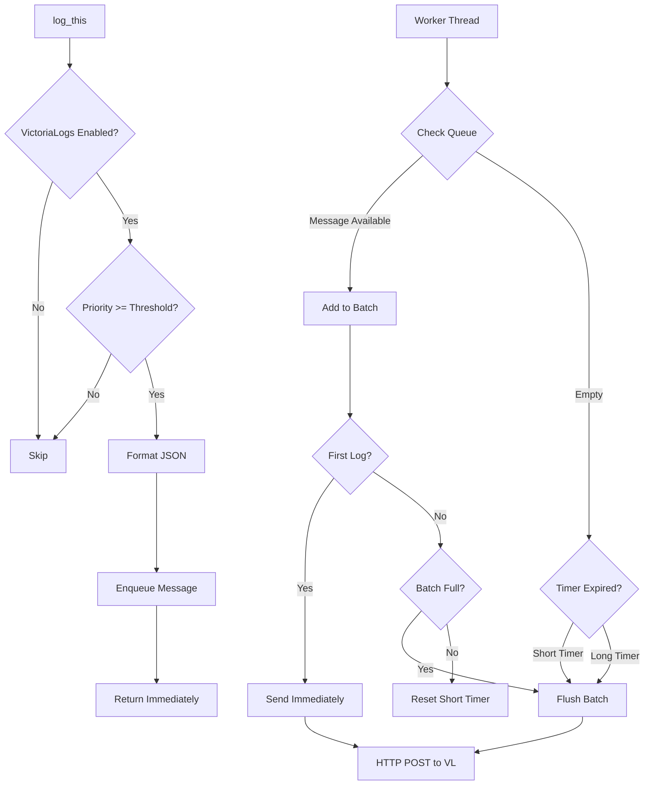
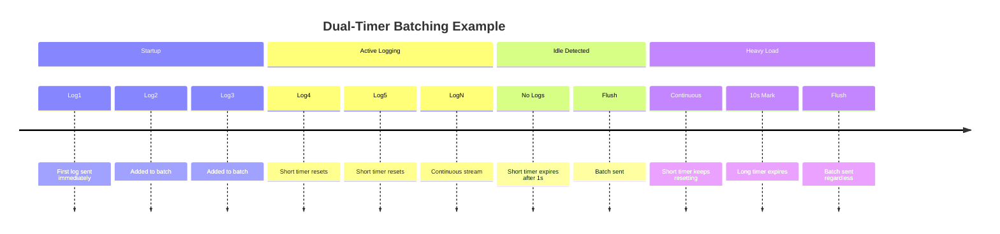

# VictoriaLogging Integration Plan

This document outlines the implementation plan for adding VictoriaLogs support to the Hydrogen server's logging subsystem.

## Overview

VictoriaLogs is a fast, cost-effective, and scalable log storage solution. This integration allows Hydrogen to send structured logs directly to a VictoriaLogs server via HTTP POST requests in newline-delimited JSON (ndjson) format.

## Environment Variables

The following environment variables control VictoriaLogging behavior:

| Variable | Description | Example |
|----------|-------------|---------|
| `VICTORIALOGS_URL` | Full VictoriaLogs insert URL | `http://10.118.0.5:9428/insert/jsonline?_stream_fields=app,kubernetes_namespace` |
| `VICTORIALOGS_LVL` | Minimum log level to send | `STATE` (default: `DEBUG`) |

Note: The URL should include the full path including `/insert/jsonline` and any query parameters like `_stream_fields`. This allows flexibility to use different VictoriaLogs endpoints or configurations without code changes.

## Log Level Mapping

Hydrogen log levels map to numeric priorities for filtering:

| Level | Value | Description |
|-------|-------|-------------|
| `TRACE` | 0 | Log everything possible |
| `DEBUG` | 1 | Debug-level messages |
| `STATE` | 2 | General information, normal operation |
| `ALERT` | 3 | Pay attention to these, not deal-breakers |
| `ERROR` | 4 | Likely need to do something here |
| `FATAL` | 5 | Cannot continue |
| `QUIET` | 6 | Used primarily for logging UI work |

Only log messages with a priority >= `VICTORIALOGS_LVL` are sent to VictoriaLogs.

## JSON Log Format

Each log entry is sent as a JSON object with the following fields:

```json
{
  "_time": "2026-02-13T11:16:00.123456789Z",
  "_msg": "System initialized successfully",
  "level": "STATE",
  "subsystem": "core",
  "app": "hydrogen",
  "kubernetes_namespace": "prod",
  "kubernetes_pod_name": "hydrogen-deployment-abc123",
  "kubernetes_container_name": "hydrogen",
  "kubernetes_node_name": "pool-1-worker-abc123",
  "host": "pool-1-worker-abc123"
}
```

### Field Descriptions

| Field | Description | Source |
|-------|-------------|--------|
| `_time` | Timestamp in RFC3339 format with nanoseconds | Generated at log time |
| `_msg` | The actual log message | From `log_this()` call |
| `level` | Log level name | From priority parameter |
| `subsystem` | Subsystem name | From `log_this()` call |
| `app` | Application name | Static: `"hydrogen"` |
| `kubernetes_namespace` | Kubernetes namespace | `K8S_NAMESPACE` env var |
| `kubernetes_pod_name` | Pod name | `K8S_POD_NAME` env var |
| `kubernetes_container_name` | Container name | `K8S_CONTAINER_NAME` env var or `"hydrogen"` |
| `kubernetes_node_name` | Node name | `K8S_NODE_NAME` env var |
| `host` | Host identifier | `gethostname()` fallback |

## HTTP Endpoint

The full URL (including path and query parameters) is specified via the `VICTORIALOGS_URL` environment variable.

Example URL:

```url
http://10.118.0.5:9428/insert/jsonline?_stream_fields=app,kubernetes_namespace,kubernetes_pod_name,kubernetes_container_name
```

The stream fields configuration groups logs from the same container instance for better compression and ordering.

### Request Headers

```headers
POST <path from VICTORIALOGS_URL> HTTP/1.1
Host: <host from VICTORIALOGS_URL>
Content-Type: application/stream+json
Content-Length: <body length>

{json line 1}\n{json line 2}\n...
```

## Kubernetes Environment Variables

When running in Kubernetes, the following environment variables should be injected via the Downward API. These provide the pod environment context needed for VictoriaLogs stream grouping.

### About the Downward API

The [Kubernetes Downward API](https://kubernetes.io/docs/concepts/workloads/pods/downward-api/) is a standard feature available in all Kubernetes clusters - no special setup, operators, or controllers are required. It allows pods to access their own metadata via environment variables or files. Simply adding `valueFrom.fieldRef` to your deployment spec makes this information available to your application.

### Required Additions to Deployment

Update the `env` section of your deployment YAML.

```yaml
env:
  # Existing variables
  - name: HYDROGEN_LOG_LEVEL
    value: "DEBUG"
  - name: PAYLOAD_KEY
    valueFrom:
      secretKeyRef:
        name: t-500nodes-secrets
        key: PAYLOAD_KEY

  # NEW: VictoriaLogs configuration
  - name: VICTORIALOGS_URL
    value: "http://10.118.0.5:9428/insert/jsonline?_stream_fields=app,kubernetes_namespace,kubernetes_pod_name,kubernetes_container_name"
  - name: VICTORIALOGS_LVL
    value: "STATE"  # Only send STATE and above to VictoriaLogs

  # NEW: Kubernetes metadata via Downward API
  - name: K8S_NAMESPACE
    valueFrom:
      fieldRef:
        fieldPath: metadata.namespace
  - name: K8S_POD_NAME
    valueFrom:
      fieldRef:
        fieldPath: metadata.name
  - name: K8S_NODE_NAME
    valueFrom:
      fieldRef:
        fieldPath: spec.nodeName
  - name: K8S_CONTAINER_NAME
    value: "hydrogen"  # Matches container name in spec
```

### Why These Variables?

| Variable | Source | Purpose |
|----------|--------|---------|
| `K8S_NAMESPACE` | Downward API | Identifies which tenant/namespace the log came from |
| `K8S_POD_NAME` | Downward API | Unique pod identifier for per-pod log streams |
| `K8S_NODE_NAME` | Downward API | Node identification for debugging node-level issues |
| `K8S_CONTAINER_NAME` | Static | Distinguishes containers when sidecars are present |

## Development Environment Setup

When running in a development environment (non-Kubernetes), the application uses fallback values. To make dev logs distinguishable from production while maintaining query compatibility, use these environment variables:

### Dev Environment Script

Create a `.env` file or export these in your dev environment:

```bash
# VictoriaLogs configuration (point to dev instance or disable)
export VICTORIALOGS_URL="http://localhost:9428/insert/jsonline?_stream_fields=app,kubernetes_namespace,kubernetes_pod_name,kubernetes_container_name"
export VICTORIALOGS_LVL="DEBUG"

# Kubernetes metadata fallbacks (explicitly set for dev)
export K8S_NAMESPACE="dev"
export K8S_POD_NAME="hydrogen-dev-$(hostname)"
export K8S_NODE_NAME="$(hostname)"
export K8S_CONTAINER_NAME="hydrogen-dev"

# Existing Hydrogen config
export HYDROGEN_LOG_LEVEL="DEBUG"
```

### Fallback Values (when env vars not set)

| Field | Dev Fallback | Example Value |
|-------|--------------|---------------|
| `kubernetes_namespace` | `"local"` | `local` |
| `kubernetes_pod_name` | `gethostname()` with prefix | `dev-mylaptop` |
| `kubernetes_node_name` | `gethostname()` | `mylaptop` |
| `kubernetes_container_name` | `"hydrogen"` | `hydrogen` |
| `host` | Same as node_name | `mylaptop` |

### Querying Dev vs Production Logs

In VictoriaLogs, you can distinguish environments using queries:

```examples
# Production logs only
{kubernetes_namespace!="local",kubernetes_namespace!="dev"}

# Specific tenant
{kubernetes_namespace="t-500nodes"}

# Dev logs only
{kubernetes_namespace=~"local|dev"}

# Specific pod in production
{kubernetes_namespace="t-500nodes",kubernetes_pod_name="www-500nodes-7d9f8b5c6f-xyz12"}
```

### Recommended Dev Values Strategy

For local development, consider using `K8S_NAMESPACE="dev-$(whoami)"` to distinguish between different developers' logs when sharing a VictoriaLogs instance:

```bash
export K8S_NAMESPACE="dev-$(whoami)"  # e.g., "dev-alice"
export K8S_POD_NAME="hydrogen-$(hostname -s)"  # e.g., "hydrogen-laptop"
```

## Implementation Architecture

### Key Design Principle: Independent Thread with Dual-Timer Batching

VictoriaLogs uses a **dedicated worker thread** with an **internal queue** for high-performance, non-blocking logging:



### Dual-Timer Batching Strategy

The worker thread implements an intelligent dual-timer system:

1. **First Log**: Sent immediately to verify connectivity
2. **Short Timer (1s)**: Resets on each new log. When it expires (no logs for 1s), the batch is sent. This ensures quick delivery during idle periods.
3. **Long Timer (10s)**: Periodic flush that catches cases where the short timer never expires due to continuous heavy load.
4. **Batch Size Limit**: Maximum 50 messages or 1MB buffer



### Why a Dedicated Thread?

| Aspect | Old Approach | New Threaded Approach |
|--------|-------------|----------------------|
| Blocking | Batch flush blocked caller | Enqueue returns immediately |
| Dependencies | Wait for queue system | Independent, starts immediately |
| Startup | Could miss early logs | Captures all logs from first line |
| Performance | HTTP in logging thread | HTTP in background thread |
| Concurrency | Mutex contention | Lock-free enqueue for caller |

### Key Constants

| Constant | Value | Description |
|----------|-------|-------------|
| `VICTORIA_LOGS_MAX_MESSAGE_SIZE` | 4096 bytes | Maximum single message size |
| `VICTORIA_LOGS_MAX_BATCH_BUFFER` | 1 MB | Maximum batch buffer size |
| `VICTORIA_LOGS_BATCH_SIZE` | 50 messages | Flush when batch reaches this size |
| `VICTORIA_LOGS_SHORT_TIMER_SEC` | 1 second | Idle timeout (resets on each log) |
| `VICTORIA_LOGS_LONG_TIMER_SEC` | 10 seconds | Maximum time between flushes |
| `VICTORIA_LOGS_MAX_QUEUE_SIZE` | 10000 messages | Queue size before dropping |
| `VICTORIA_LOGS_TIMEOUT_SEC` | 5 seconds | HTTP request timeout |

### Important: No JSON Configuration

VictoriaLogs is **intentionally excluded** from the JSON configuration system. There is no `LoggingConfig.victorialogs` field, no config schema entries, and no `load_logging_config()` processing for VictoriaLogs. This is by design to ensure:

- No waiting for config file parsing
- No dependency on the config subsystem
- Credentials/URLs stay in environment variables only
- Logging works from the very first line of code

### Code Integration Points

#### 1. VictoriaLogs Configuration Structure

See [`src/logging/victoria_logs.h`](/elements/001-hydrogen/hydrogen/src/logging/victoria_logs.h):

```c
// VictoriaLogs configuration from environment variables
typedef struct VictoriaLogsConfig {
    bool enabled;
    char* url;
    int min_level;
    char* k8s_namespace;
    char* k8s_pod_name;
    char* k8s_container_name;
    char* k8s_node_name;
    char* host;
} VictoriaLogsConfig;

// Thread-safe message queue
typedef struct VLMessageQueue {
    VLQueueNode* head;
    VLQueueNode* tail;
    size_t size;
    size_t max_size;
    pthread_mutex_t mutex;
    pthread_cond_t cond;
} VLMessageQueue;

// Worker thread state with dual-timer batching
typedef struct VLThreadState {
    pthread_t thread;
    bool running;
    bool shutdown;
    char* batch_buffer;
    size_t batch_buffer_size;
    size_t batch_count;
    struct timespec short_timer;
    struct timespec long_timer;
    bool short_timer_active;
    bool first_log_sent;
    VLMessageQueue queue;
} VLThreadState;
```

#### 2. Initialization (Early Startup)

VictoriaLogs initialization happens immediately after `init_startup_log_level()` in `main()`:

```c
// src/logging/victoria_logs.c
bool init_victoria_logs(void) {
    // Check if VICTORIALOGS_URL is set
    const char* url = getenv("VICTORIALOGS_URL");
    if (!url || !url[0]) {
        victoria_logs_config.enabled = false;
        return true;
    }
    
    // Parse configuration from environment
    // ... cache K8S metadata, parse log level ...
    
    // Initialize queue
    if (!vl_queue_init()) {
        return false;
    }
    
    // Allocate batch buffer
    victoria_logs_thread.batch_buffer = malloc(VICTORIA_LOGS_MAX_BATCH_BUFFER);
    
    // Start worker thread
    pthread_create(&victoria_logs_thread.thread, NULL, victoria_logs_worker, NULL);
    
    return true;
}
```

#### 3. Log Message Integration

The [`log_this()`](/elements/001-hydrogen/hydrogen/src/logging/logging.c) function sends to VictoriaLogs **independently** of other logging systems:

```c
void log_this(const char* subsystem, const char* format, int priority, int num_args, ...) {
    // ... existing validation ...
    
    // Format the message
    char details[DEFAULT_LOG_ENTRY_SIZE];
    va_list args;
    va_start(args, num_args);
    vsnprintf(details, sizeof(details), format, args);
    va_end(args);
    
    // Send to VictoriaLogs immediately (non-blocking enqueue)
    if (victoria_logs_is_enabled()) {
        victoria_logs_send(subsystem, details, priority);  // Returns immediately
    }
    
    // ... rest of existing logging logic ...
}
```

#### 4. Worker Thread Implementation

The worker thread ([`victoria_logs_worker()`](/elements/001-hydrogen/hydrogen/src/logging/victoria_logs.c)) implements the dual-timer batching:

```c
static void* victoria_logs_worker(void* arg) {
    // Initialize timers
    clock_gettime(CLOCK_REALTIME, &victoria_logs_thread.long_timer);
    victoria_logs_thread.long_timer.tv_sec += VICTORIA_LOGS_LONG_TIMER_SEC;
    
    while (!victoria_logs_thread.shutdown) {
        // Calculate next timeout (earlier of short or long timer)
        struct timespec timeout = calculate_next_timeout();
        
        // Wait for message or timeout
        char* message = vl_queue_dequeue_timed(&timeout);
        
        if (message) {
            if (!victoria_logs_thread.first_log_sent) {
                // First log: send immediately
                add_to_batch(message);
                flush_batch_internal();
                victoria_logs_thread.first_log_sent = true;
            } else {
                // Add to batch
                add_to_batch(message);
                
                // Check if batch is full
                if (victoria_logs_thread.batch_count >= VICTORIA_LOGS_BATCH_SIZE) {
                    flush_batch_internal();
                    reset_long_timer();
                }
            }
            
            // Reset short timer on each log
            reset_short_timer();
        }
        
        // Check for timer expiration and flush if needed
        check_and_flush_timers();
    }
    
    // Final flush before exit
    flush_batch_internal();
    return NULL;
}
```

#### 5. Non-Blocking Enqueue

The [`victoria_logs_send()`](/elements/001-hydrogen/hydrogen/src/logging/victoria_logs.c) function formats and enqueues without blocking:

```c
bool victoria_logs_send(const char* subsystem, const char* message, int priority) {
    // Check enabled and log level
    if (!victoria_logs_is_enabled() || priority < min_level) {
        return true;
    }
    
    // Format JSON message with timestamp, K8S metadata, etc.
    char json[VICTORIA_LOGS_MAX_MESSAGE_SIZE];
    build_json_message(subsystem, message, priority, json, sizeof(json));
    
    // Enqueue for worker thread (non-blocking)
    return vl_queue_enqueue(json);
}
```

## Testing Strategy

### Unit Tests

Create tests/unity/test_victoria_logs.c:

1. **Configuration parsing**: Test environment variable reading
2. **Log level mapping**: Test string-to-level conversion
3. **JSON formatting**: Test message builder output
4. **JSON escaping**: Test special character handling
5. **Queue operations**: Test enqueue/dequeue behavior
6. **Batching logic**: Test timer-based flushing

### Integration Tests

1. **Local VictoriaLogs**: Start local instance, send logs, query via API
2. **Log level filtering**: Verify only appropriate levels are sent
3. **Kubernetes metadata**: Verify fallback values in dev environment
4. **Batch behavior**: Verify dual-timer flushing
5. **Queue overflow**: Verify graceful message dropping when queue full
6. **Thread lifecycle**: Verify startup and shutdown behavior

## Error Handling

| Scenario | Behavior |
|----------|----------|
| VICTORIALOGS_URL not set | VictoriaLogs disabled, no error |
| VICTORIALOGS_URL invalid URL | Log error, disable VictoriaLogs |
| Connection failure | Log error, batch cleared (no infinite retry) |
| HTTP error response | Log error, continue operation |
| Queue full | Drop message, continue operation |
| Memory allocation failure | Disable VictoriaLogs, log error |
| Thread creation failure | Disable VictoriaLogs, log error |

## Performance Considerations

1. **Non-blocking enqueue**: `victoria_logs_send()` returns immediately after enqueuing
2. **Dedicated thread**: HTTP operations don't block the logging thread
3. **Dual-timer batching**: Balances latency and throughput
4. **Batch size limit**: Prevents excessive memory usage
5. **Queue size limit**: Prevents unbounded memory growth under heavy load
6. **Zero-copy where possible**: Messages are queued by pointer

## Security Considerations

1. **No sensitive data**: Ensure no passwords/tokens in log messages sent externally
2. **TLS support**: Support `https://` URLs for encrypted transmission
3. **URL validation**: Validate destination URL format
4. **Buffer limits**: Prevent buffer overflows in message building
5. **Environment-only config**: No credentials in JSON config files

## Future Enhancements

1. **Compression**: Add gzip compression for large batches
2. **Retry logic**: Implement exponential backoff for failed sends
3. **Metrics**: Track bytes sent, errors, queue depth
4. **Dynamic config**: Support runtime configuration changes via SIGHUP
5. **Structured fields**: Allow custom fields from log_this() calls
6. **Persistent queue**: Save queue to disk for crash recovery

## References

- [VictoriaLogs Documentation](https://docs.victoriametrics.com/victorialogs/)
- [VictoriaLogs JSON Ingestion API](https://docs.victoriametrics.com/victorialogs/data-ingestion/#json-stream-api)
- Implementation: [`src/logging/victoria_logs.c`](/elements/001-hydrogen/hydrogen/src/logging/victoria_logs.c)
- Header: [`src/logging/victoria_logs.h`](/elements/001-hydrogen/hydrogen/src/logging/victoria_logs.h)
- Integration: [`src/logging/logging.c`](/elements/001-hydrogen/hydrogen/src/logging/logging.c)
