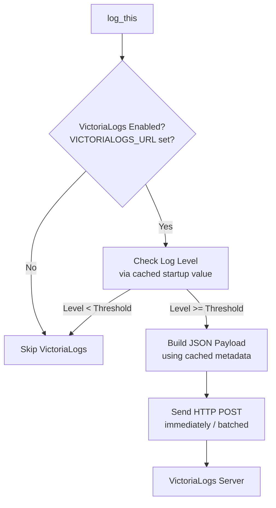

# VictoriaLogging Integration Plan

This document outlines the implementation plan for adding VictoriaLogs support to the Hydrogen server's logging subsystem.

## Overview

VictoriaLogs is a fast, cost-effective, and scalable log storage solution. This integration allows Hydrogen to send structured logs directly to a VictoriaLogs server via HTTP POST requests in newline-delimited JSON (ndjson) format.

## Environment Variables

The following environment variables control VictoriaLogging behavior:

| Variable | Description | Example |
|----------|-------------|---------|
| `VICTORIALOGS_URL` | Full VictoriaLogs insert URL | `http://10.118.0.5:9428/insert/jsonline?_stream_fields=app,kubernetes_namespace` |
| `VICTORIALOGS_LVL` | Minimum log level to send | `STATE` (default: `DEBUG`) |

Note: The URL should include the full path including `/insert/jsonline` and any query parameters like `_stream_fields`. This allows flexibility to use different VictoriaLogs endpoints or configurations without code changes.

## Log Level Mapping

Hydrogen log levels map to numeric priorities for filtering:

| Level | Value | Description |
|-------|-------|-------------|
| `TRACE` | 0 | Log everything possible |
| `DEBUG` | 1 | Debug-level messages |
| `STATE` | 2 | General information, normal operation |
| `ALERT` | 3 | Pay attention to these, not deal-breakers |
| `ERROR` | 4 | Likely need to do something here |
| `FATAL` | 5 | Cannot continue |
| `QUIET` | 6 | Used primarily for logging UI work |

Only log messages with a priority >= `VICTORIALOGS_LVL` are sent to VictoriaLogs.

## JSON Log Format

Each log entry is sent as a JSON object with the following fields:

```json
{
  "_time": "2026-02-13T11:16:00.123456789Z",
  "_msg": "System initialized successfully",
  "level": "STATE",
  "subsystem": "core",
  "app": "hydrogen",
  "kubernetes_namespace": "prod",
  "kubernetes_pod_name": "hydrogen-deployment-abc123",
  "kubernetes_container_name": "hydrogen",
  "kubernetes_node_name": "pool-1-worker-abc123",
  "host": "pool-1-worker-abc123"
}
```

### Field Descriptions

| Field | Description | Source |
|-------|-------------|--------|
| `_time` | Timestamp in RFC3339 format with nanoseconds | Generated at log time |
| `_msg` | The actual log message | From `log_this()` call |
| `level` | Log level name | From priority parameter |
| `subsystem` | Subsystem name | From `log_this()` call |
| `app` | Application name | Static: `"hydrogen"` |
| `kubernetes_namespace` | Kubernetes namespace | `K8S_NAMESPACE` env var |
| `kubernetes_pod_name` | Pod name | `K8S_POD_NAME` env var |
| `kubernetes_container_name` | Container name | `K8S_CONTAINER_NAME` env var or `"hydrogen"` |
| `kubernetes_node_name` | Node name | `K8S_NODE_NAME` env var |
| `host` | Host identifier | `gethostname()` fallback |

## HTTP Endpoint

The full URL (including path and query parameters) is specified via the `VICTORIALOGS_URL` environment variable.

Example URL:
```
http://10.118.0.5:9428/insert/jsonline?_stream_fields=app,kubernetes_namespace,kubernetes_pod_name,kubernetes_container_name
```

The stream fields configuration groups logs from the same container instance for better compression and ordering.

### Request Headers

```
POST <path from VICTORIALOGS_URL> HTTP/1.1
Host: <host from VICTORIALOGS_URL>
Content-Type: application/stream+json
Content-Length: <body length>

{json line 1}\n{json line 2}\n...
```

## Kubernetes Environment Variables

When running in Kubernetes, the following environment variables should be injected via the Downward API. These provide the pod environment context needed for VictoriaLogs stream grouping.

### About the Downward API

The [Kubernetes Downward API](https://kubernetes.io/docs/concepts/workloads/pods/downward-api/) is a standard feature available in all Kubernetes clusters - no special setup, operators, or controllers are required. It allows pods to access their own metadata via environment variables or files. Simply adding `valueFrom.fieldRef` to your deployment spec makes this information available to your application.

### Required Additions to Deployment

Update the `env` section of your deployment YAML (e.g., [`t-500nodes-deployment.yaml`](/mnt/extra/Projects/Festival/tenants/t-500nodes/t-500nodes-deployment.yaml)):

```yaml
env:
  # Existing variables
  - name: HYDROGEN_LOG_LEVEL
    value: "DEBUG"
  - name: PAYLOAD_KEY
    valueFrom:
      secretKeyRef:
        name: t-500nodes-secrets
        key: PAYLOAD_KEY

  # NEW: VictoriaLogs configuration
  - name: VICTORIALOGS_URL
    value: "http://10.118.0.5:9428/insert/jsonline?_stream_fields=app,kubernetes_namespace,kubernetes_pod_name,kubernetes_container_name"
  - name: VICTORIALOGS_LVL
    value: "STATE"  # Only send STATE and above to VictoriaLogs

  # NEW: Kubernetes metadata via Downward API
  - name: K8S_NAMESPACE
    valueFrom:
      fieldRef:
        fieldPath: metadata.namespace
  - name: K8S_POD_NAME
    valueFrom:
      fieldRef:
        fieldPath: metadata.name
  - name: K8S_NODE_NAME
    valueFrom:
      fieldRef:
        fieldPath: spec.nodeName
  - name: K8S_CONTAINER_NAME
    value: "hydrogen"  # Matches container name in spec
```

### Why These Variables?

| Variable | Source | Purpose |
|----------|--------|---------|
| `K8S_NAMESPACE` | Downward API | Identifies which tenant/namespace the log came from |
| `K8S_POD_NAME` | Downward API | Unique pod identifier for per-pod log streams |
| `K8S_NODE_NAME` | Downward API | Node identification for debugging node-level issues |
| `K8S_CONTAINER_NAME` | Static | Distinguishes containers when sidecars are present |

## Development Environment Setup

When running in a development environment (non-Kubernetes), the application uses fallback values. To make dev logs distinguishable from production while maintaining query compatibility, use these environment variables:

### Dev Environment Script

Create a `.env` file or export these in your dev environment:

```bash
# VictoriaLogs configuration (point to dev instance or disable)
export VICTORIALOGS_URL="http://localhost:9428/insert/jsonline?_stream_fields=app,kubernetes_namespace,kubernetes_pod_name,kubernetes_container_name"
export VICTORIALOGS_LVL="DEBUG"

# Kubernetes metadata fallbacks (explicitly set for dev)
export K8S_NAMESPACE="dev"
export K8S_POD_NAME="hydrogen-dev-$(hostname)"
export K8S_NODE_NAME="$(hostname)"
export K8S_CONTAINER_NAME="hydrogen-dev"

# Existing Hydrogen config
export HYDROGEN_LOG_LEVEL="DEBUG"
```

### Fallback Values (when env vars not set)

| Field | Dev Fallback | Example Value |
|-------|--------------|---------------|
| `kubernetes_namespace` | `"local"` | `local` |
| `kubernetes_pod_name` | `gethostname()` with prefix | `dev-mylaptop` |
| `kubernetes_node_name` | `gethostname()` | `mylaptop` |
| `kubernetes_container_name` | `"hydrogen"` | `hydrogen` |
| `host` | Same as node_name | `mylaptop` |

### Querying Dev vs Production Logs

In VictoriaLogs, you can distinguish environments using queries:

```
# Production logs only
{kubernetes_namespace!="local",kubernetes_namespace!="dev"}

# Specific tenant
{kubernetes_namespace="t-500nodes"}

# Dev logs only
{kubernetes_namespace=~"local|dev"}

# Specific pod in production
{kubernetes_namespace="t-500nodes",kubernetes_pod_name="www-500nodes-7d9f8b5c6f-xyz12"}
```

### Recommended Dev Values Strategy

For local development, consider using `K8S_NAMESPACE="dev-$(whoami)"` to distinguish between different developers' logs when sharing a VictoriaLogs instance:

```bash
export K8S_NAMESPACE="dev-$(whoami)"  # e.g., "dev-alice"
export K8S_POD_NAME="hydrogen-$(hostname -s)"  # e.g., "hydrogen-laptop"
```

## Implementation Architecture

### Key Design Principle: Immediate Startup, Zero Dependencies

Unlike other logging destinations (database, file, notify), VictoriaLogs logging is intentionally **environment-variable only** with **no JSON configuration section**. This design choice ensures:

1. **No dependencies**: VictoriaLogs operates independently of the config system, database, queue system, or any other subsystem
2. **Immediate startup**: Logs can be sent from the very first line of code - no waiting for subsystem initialization
3. **Fail-safe operation**: If VictoriaLogs is unavailable, the application continues without error
4. **Zero configuration files**: No credentials or URLs stored in JSON configs - everything is environment-driven

This is in contrast to other logging types that may wait for:
- Database subsystem to be ready (database logging)
- Config system to be parsed (all JSON-configured logging)
- Queue system to be initialized (batched destinations)
- File system to be ready (file logging)



**Important**: VictoriaLogs initialization happens in `init_startup_log_level()` (or early in `main()`) and caches all needed metadata (URL, K8S values, log level) so that logging works immediately without any subsystem dependencies.

## Code Integration Points

### Important: No JSON Configuration

VictoriaLogs is **intentionally excluded** from the JSON configuration system. There is no `LoggingConfig.victorialogs` field, no config schema entries, and no `load_logging_config()` processing for VictoriaLogs. This is by design to ensure:
- No waiting for config file parsing
- No dependency on the config subsystem
- Credentials/URLs stay in environment variables only
- Logging works from the very first line of code

### 1. VictoriaLogs Configuration Structure

Add to [`src/config/config_logging.h`](elements/001-hydrogen/hydrogen/src/config/config_logging.h):

```c
// VictoriaLogs destination configuration
typedef struct VictoriaLogsConfig {
    bool enabled;           // VICTORIALOGS_URL is set
    char* url;              // VICTORIALOGS_URL value (full endpoint URL)
    int min_level;          // VICTORIALOGS_LVL mapped to numeric
    
    // Cached environment metadata
    char* k8s_namespace;
    char* k8s_pod_name;
    char* k8s_container_name;
    char* k8s_node_name;
    char* host;
} VictoriaLogsConfig;
```

### 2. Initialization (Early Startup)

VictoriaLogs initialization must happen **early in startup**, before any logging occurs. This is similar to how [`init_startup_log_level()`](elements/001-hydrogen/hydrogen/src/globals.c:44) works in [`globals.c`](elements/001-hydrogen/hydrogen/src/globals.c). The initialization should read environment variables and cache all metadata so logging works immediately.

Recommended location: Call `init_victoria_logs()` immediately after `init_startup_log_level()` in `main()`.

```c
// src/logging/victoria_logs.h
bool init_victoria_logs(VictoriaLogsConfig* config);
void cleanup_victoria_logs(VictoriaLogsConfig* config);

// Global instance (similar to startup_log_level)
extern VictoriaLogsConfig victoria_logs_config;

// src/logging/victoria_logs.c
// Global config - accessible immediately after init
VictoriaLogsConfig victoria_logs_config = {0};

bool init_victoria_logs(VictoriaLogsConfig* config) {
    // Check if VICTORIALOGS_URL is set - if not, silently disable
    const char* url = getenv("VICTORIALOGS_URL");
    if (!url || !url[0]) {
        config->enabled = false;
        return true;  // Not an error, just disabled
    }

    config->enabled = true;
    config->url = strdup(url);  // Full URL including path and query params
    
    // Parse log level
    const char* lvl = getenv("VICTORIALOGS_LVL");
    config->min_level = parse_log_level(lvl, LOG_LEVEL_DEBUG);  // Default DEBUG
    
    // Cache Kubernetes metadata with fallbacks
    const char* ns = getenv("K8S_NAMESPACE");
    config->k8s_namespace = strdup((ns && ns[0]) ? ns : "local");
    
    const char* pod = getenv("K8S_POD_NAME");
    if (pod && pod[0]) {
        config->k8s_pod_name = strdup(pod);
    } else {
        char hostname[256];
        if (gethostname(hostname, sizeof(hostname)) == 0) {
            config->k8s_pod_name = strdup(hostname);
        } else {
            config->k8s_pod_name = strdup("localhost");
        }
    }
    
    const char* container = getenv("K8S_CONTAINER_NAME");
    config->k8s_container_name = strdup((container && container[0]) ? container : "hydrogen");
    
    const char* node = getenv("K8S_NODE_NAME");
    if (node && node[0]) {
        config->k8s_node_name = strdup(node);
    } else {
        char hostname[256];
        if (gethostname(hostname, sizeof(hostname)) == 0) {
            config->k8s_node_name = strdup(hostname);
        } else {
            config->k8s_node_name = strdup("localhost");
        }
    }
    
    // Host is same as node name for consistency
    config->host = strdup(config->k8s_node_name);
    
    return true;
}
```

### 3. Log Message Integration

Modify [`log_this()`](elements/001-hydrogen/hydrogen/src/logging/logging.c:451) in [`src/logging/logging.c`](elements/001-hydrogen/hydrogen/src/logging/logging.c) to send to VictoriaLogs **independently of the config system**:

```c
void log_this(const char* subsystem, const char* format, int priority, int num_args, ...) {
    // ... existing validation and setup ...

    // Create JSON message for queue destinations (existing code)
    char json_message[DEFAULT_MAX_LOG_MESSAGE_SIZE];
    snprintf(json_message, sizeof(json_message),
             "{\"subsystem\":\"%s\",\"details\":\"%s\",\"priority\":%d,...}",
             subsystem, details, priority, ...);

    // VictoriaLogs: Check global config directly (NOT app_config->logging)
    // This works immediately on startup, before app_config is even loaded
    if (victoria_logs_config.enabled && priority >= victoria_logs_config.min_level) {
        // Build VictoriaLogs-specific JSON with _time and _msg
        char vl_message[DEFAULT_MAX_LOG_MESSAGE_SIZE * 2];
        build_victoria_logs_message(&victoria_logs_config,
                                    subsystem, details, priority,
                                    vl_message, sizeof(vl_message));

        // Send immediately or add to simple queue (no dependencies on queue system)
        victoria_logs_send(vl_message);
    }

    // ... rest of existing logging logic (uses app_config, queue system, etc.) ...
}
```

### 4. VictoriaLogs Message Builder

```c
void build_victoria_logs_message(const VictoriaLogsConfig* config,
                                 const char* subsystem,
                                 const char* message,
                                 int priority,
                                 char* output,
                                 size_t output_size) {
    // Get current timestamp with nanoseconds
    struct timespec ts;
    clock_gettime(CLOCK_REALTIME, &ts);
    struct tm* tm_info = gmtime(&ts.tv_sec);
    
    char timestamp[64];
    strftime(timestamp, sizeof(timestamp), "%Y-%m-%dT%H:%M:%S", tm_info);
    snprintf(timestamp + 19, sizeof(timestamp) - 19, ".%09ldZ", ts.tv_nsec);
    
    const char* level_label = get_priority_label(priority);
    
    // Build JSON with proper escaping
    snprintf(output, output_size,
        "{"
        "\"_time\":\"%s\","
        "\"_msg\":\"%s\","
        "\"level\":\"%s\","
        "\"subsystem\":\"%s\","
        "\"app\":\"hydrogen\","
        "\"kubernetes_namespace\":\"%s\","
        "\"kubernetes_pod_name\":\"%s\","
        "\"kubernetes_container_name\":\"%s\","
        "\"kubernetes_node_name\":\"%s\","
        "\"host\":\"%s\""
        "}",
        timestamp,
        escape_json_string(message),  // Need proper JSON escaping
        level_label,
        subsystem,
        config->k8s_namespace,
        config->k8s_pod_name,
        config->k8s_container_name,
        config->k8s_node_name,
        config->host
    );
}
```

### 5. VictoriaLogs Queue Manager

Create [`src/logging/victoria_logs_manager.c`](elements/001-hydrogen/hydrogen/src/logging/victoria_logs_manager.c):

```c
void* victoria_logs_manager(void* arg) {
    Queue* vl_queue = (Queue*)arg;
    
    add_service_thread(&logging_threads, pthread_self());
    pthread_cleanup_push(cleanup_victoria_logs_manager, NULL);
    
    log_this(SR_LOGGING, "VictoriaLogs manager started", LOG_LEVEL_STATE, 0);
    
    char batch_buffer[MAX_BATCH_SIZE];
    size_t batch_count = 0;
    time_t last_flush = time(NULL);
    
    while (!vl_queue_shutdown) {
        // Wait for messages or timeout
        pthread_mutex_lock(&vl_terminate_mutex);
        while (queue_size(vl_queue) == 0 && !vl_queue_shutdown) {
            struct timespec timeout;
            clock_gettime(CLOCK_REALTIME, &timeout);
            timeout.tv_sec += BATCH_TIMEOUT_SEC;
            pthread_cond_timedwait(&vl_terminate_cond, &vl_terminate_mutex, &timeout);
        }
        pthread_mutex_unlock(&vl_terminate_mutex);
        
        // Collect messages into batch
        while (queue_size(vl_queue) > 0 && batch_count < MAX_BATCH_SIZE) {
            size_t message_size;
            int priority;
            char* message = queue_dequeue(vl_queue, &message_size, &priority);
            if (message) {
                // Append to batch buffer with newline separator
                if (batch_count > 0) {
                    strncat(batch_buffer, "\n", sizeof(batch_buffer) - strlen(batch_buffer) - 1);
                }
                strncat(batch_buffer, message, sizeof(batch_buffer) - strlen(batch_buffer) - 1);
                batch_count++;
                free(message);
            }
        }
        
        // Flush batch if full or timeout
        time_t now = time(NULL);
        if (batch_count >= BATCH_MAX_MESSAGES || 
            (batch_count > 0 && (now - last_flush) >= BATCH_TIMEOUT_SEC) ||
            (vl_queue_shutdown && batch_count > 0)) {
            
            send_victoria_logs_batch(&app_config->logging.victorialogs, batch_buffer);
            batch_buffer[0] = '\0';
            batch_count = 0;
            last_flush = now;
        }
    }
    
    log_this(SR_LOGGING, "VictoriaLogs manager exiting", LOG_LEVEL_STATE, 0);
    pthread_cleanup_pop(1);
    return NULL;
}
```

### 6. HTTP Sender

```c
bool send_victoria_logs_batch(const VictoriaLogsConfig* config, const char* batch) {
    if (!config || !config->enabled || !batch || !batch[0]) {
        return false;
    }

    // Parse the full URL from config
    char host[256];
    int port;
    char path[1024];  // Includes /insert/jsonline and query params
    bool use_ssl;

    if (!parse_url(config->url, host, &port, path, &use_ssl)) {
        log_this(SR_LOGGING, "Invalid VictoriaLogs URL", LOG_LEVEL_ERROR, 0);
        return false;
    }

    // Build HTTP request using parsed components
    char request[4096];
    size_t body_len = strlen(batch);

    snprintf(request, sizeof(request),
        "POST %s HTTP/1.1\r\n"
        "Host: %s:%d\r\n"
        "Content-Type: application/stream+json\r\n"
        "Content-Length: %zu\r\n"
        "Connection: keep-alive\r\n"
        "\r\n"
        "%s",
        path, host, port, body_len, batch);
    
    // Send via socket (reuse existing network code)
    int sock = connect_to_server(host, port, use_ssl);
    if (sock < 0) {
        log_this(SR_LOGGING, "Failed to connect to VictoriaLogs", LOG_LEVEL_ERROR, 0);
        return false;
    }
    
    ssize_t sent = send(sock, request, strlen(request), 0);
    if (sent < 0) {
        close(sock);
        log_this(SR_LOGGING, "Failed to send to VictoriaLogs", LOG_LEVEL_ERROR, 0);
        return false;
    }
    
    // Read response (non-blocking or with timeout)
    char response[1024];
    ssize_t received = recv(sock, response, sizeof(response) - 1, 0);
    close(sock);
    
    if (received > 0) {
        response[received] = '\0';
        // Check for 204 No Content (success)
        if (strstr(response, "204 No Content") != NULL) {
            return true;
        }
        // Log unexpected responses
        log_this(SR_LOGGING, "VictoriaLogs returned non-204 response", LOG_LEVEL_ALERT, 0);
    }
    
    return false;
}
```

## Testing Strategy

### Unit Tests

Create [`tests/unity/test_victoria_logs.c`](elements/001-hydrogen/hydrogen/tests/unity/test_victoria_logs.c):

1. **Configuration parsing**: Test environment variable reading
2. **Log level mapping**: Test string-to-level conversion
3. **JSON formatting**: Test message builder output
4. **Batching**: Test batch collection and flushing logic
5. **URL parsing**: Test destination URL parsing

### Integration Tests

1. **Local VictoriaLogs**: Start local VictoriaLogs instance, send logs, query via API
2. **Log level filtering**: Verify only appropriate levels are sent
3. **Kubernetes metadata**: Verify fallback values in dev environment
4. **Batch behavior**: Verify batching and timeout flushing

## Error Handling

| Scenario | Behavior |
|----------|----------|
| VICTORIALOGS_URL not set | VictoriaLogs disabled, no error |
| VICTORIALOGS_URL invalid URL | Log error, disable VictoriaLogs |
| Connection failure | Log error, retry with backoff |
| HTTP error response | Log error, continue operation |
| Memory allocation failure | Log error, skip VictoriaLogs for this message |

## Performance Considerations

1. **Batched sends**: Collect multiple log entries before sending (default: 50 messages or 5 seconds)
2. **Non-blocking**: Queue operations don't block log_this() caller
3. **Keep-alive**: Use HTTP keep-alive connections where possible
4. **JSON escaping**: Minimal overhead for message escaping
5. **Zero-copy**: Avoid unnecessary string copying where possible

## Security Considerations

1. **No sensitive data**: Ensure no passwords/tokens in log messages sent externally
2. **TLS support**: Support `https://` URLs for encrypted transmission
3. **URL validation**: Validate destination URL format
4. **Buffer limits**: Prevent buffer overflows in message building

## Future Enhancements

1. **Compression**: Add gzip compression for large batches
2. **Retry logic**: Implement exponential backoff for failed sends
3. **Metrics**: Track bytes sent, errors, queue depth
4. **Dynamic config**: Support runtime configuration changes via SIGHUP
5. **Structured fields**: Allow custom fields from log_this() calls

## References

- [VictoriaLogs Documentation](https://docs.victoriametrics.com/victorialogs/)
- [VictoriaLogs JSON Ingestion API](https://docs.victoriametrics.com/victorialogs/data-ingestion/#json-stream-api)
- Existing Hydrogen logging: [`src/logging/logging.c`](elements/001-hydrogen/hydrogen/src/logging/logging.c)
- Configuration system: [`src/config/config_logging.h`](elements/001-hydrogen/hydrogen/src/config/config_logging.h)
