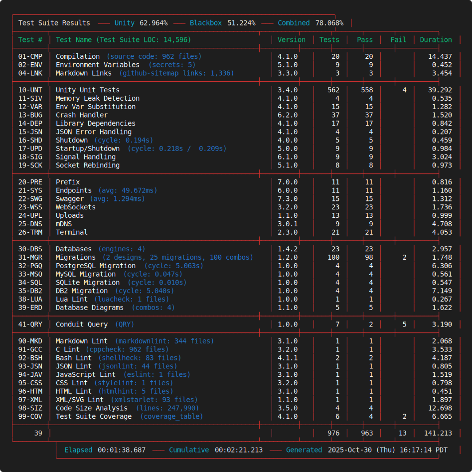
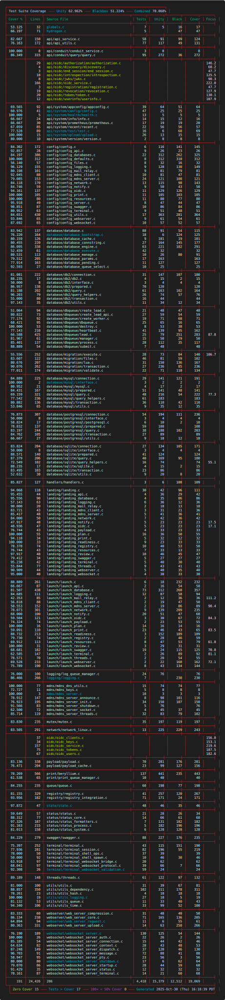
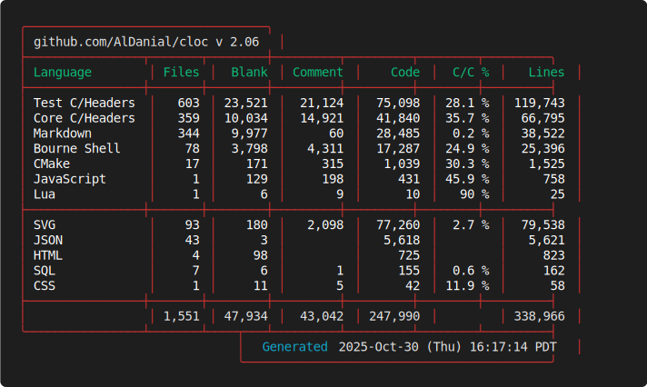
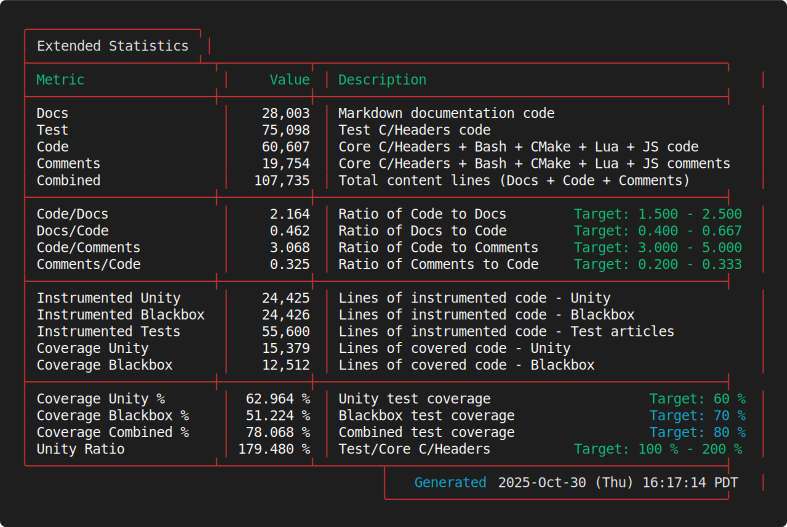

# Hydrogen

## Overview

Hydrogen is a high-performance, multithreaded server.

- Web Server: Delivers static content and exposes a comprehensive REST API
- WebSocket Server: Enables real-time bidirectional communication with guaranteed message delivery
- mDNS Client/Server: Handles service discovery and auto-configuration
- Queue System: Provides thread-safe data management across all components
- Print Server: Offers complete 3D printer control and monitoring capabilities
- OIDC Provider: Implements OpenID Connect protocol for secure authentication and authorization

Its modular architecture and emphasis on performance make it an ideal elemental core for both Philement projects and broader applications.

## Intended Audience & Requirements

Hydrogen is currently designed for technical users who:

- Are comfortable working with Linux-based systems
- Have experience with command-line interfaces and system configuration
- Understand basic networking concepts and server administration
- Are familiar with development tools and building software from source

**Platform Support:**

- Primary Platform: Linux-based systems - Fedora and Ubuntu to start with.

## Table of Contents

### Getting Started

- [**AI Recipe**](RECIPE.md) - Development guide optimized for AI assistance
- [**Project Structure**](STRUCTURE.md) - Complete file organization and architecture overview
- [**Build Environment**](SETUP.md) - Build and runtime requirements, environment setup
- [**Secrets Management**](SECRETS.md) - Environment variables and security configuration
- [**Release Notes**](RELEASES.md) - Detailed version history and changes
- [**Markdown Site Map**](SITEMAP.md) - Index to all Markdown files in this repository

### Core Documentation

- [**Documentation Hub**](docs/README.md) - Start here for comprehensive overview
- [**Developer Onboarding**](docs/developer_onboarding.md) - Visual architecture overview and code navigation
- [**Quick Start Guide**](docs/guides/quick-start.md) - Get up and running quickly
- [**AI Integration**](docs/ai_integration.md) - AI capabilities and implementations
- [**Build Metrics**](docs/metrics/README.md) - Daily build metrics and quality tracking

### Technical References

- [**API Documentation**](docs/api.md) - REST API reference and implementation details
- [**Configuration Guide**](docs/configuration.md) - System configuration and settings
- [**Data Structures**](docs/data_structures.md) - Core data structures and interfaces
- [**Testing Framework**](docs/testing.md) - Testing documentation and procedures

### Architecture & Design

- [**Service Architecture**](docs/service.md) - Service management and lifecycle
- [**Shutdown Architecture**](docs/shutdown_architecture.md) - Graceful shutdown procedures
- [**Thread Monitoring**](docs/thread_monitoring.md) - Thread management and monitoring
- [**WebSocket Implementation**](docs/web_socket.md) - WebSocket server architecture
- [**mDNS Server**](docs/mdns_server.md) - Service discovery implementation
- [**Print Queue System**](docs/print_queue.md) - 3D printing queue management
- [**OIDC Integration**](docs/oidc_integration.md) - OpenID Connect authentication
- [**System Information**](docs/system_info.md) - System monitoring and reporting

### Examples & Implementation

- [**Examples Overview**](examples/README.md) - Code examples and implementations
- [**Build Scripts & Utilities**](extras/README.md) - Build scripts and diagnostic tools
- [**API Implementation**](src/api/README.md) - API implementation details
- [**Payload System**](payloads/README.md) - Payload system with encryption
- [**Testing Suite**](tests/README.md) - Test framework and procedures

## Latest Test Results

  
  

## Repository Information

  
  

