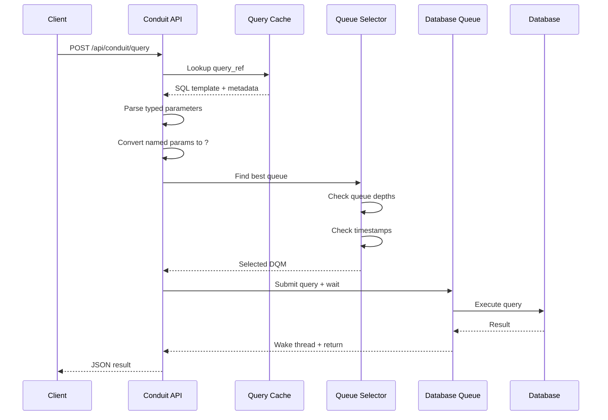
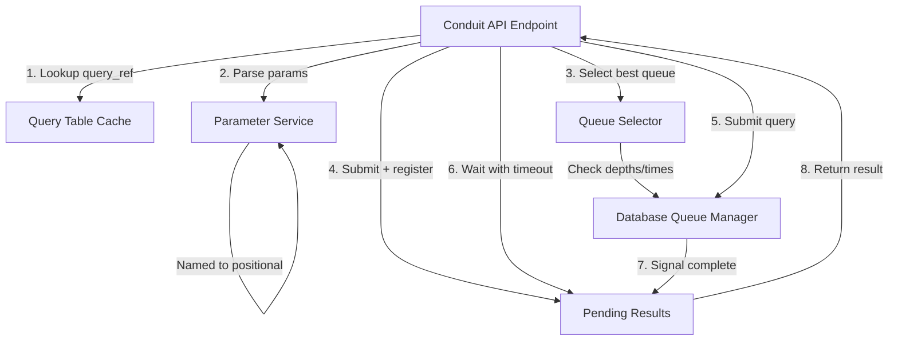
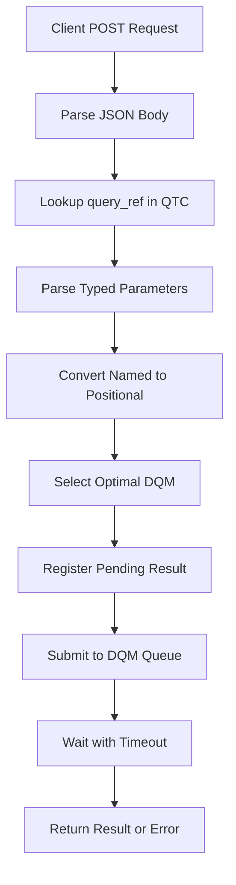
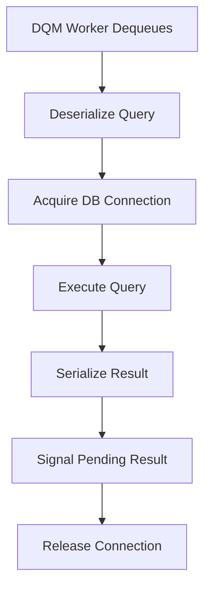

# Conduit Service Implementation Plan

## Quick Start Guide

1. **Read This First**: [`CONDUIT.md`](CONDUIT.md) - This document (comprehensive plan)
2. **Check Context**: [`DATABASE_PLAN.md`](DATABASE_PLAN.md) - Existing database architecture
3. **Review Code**: [`src/database/`](../../src/database/) - Current database implementation
4. **Start With**: Phase 1 (Query Table Cache) - Foundation for everything else
5. **Build Order**: QTC → Queue Selection → Parameter Processing → Pending Results → API Endpoint
6. **Test As You Go**: Write unit tests for each component before moving to next phase

## Executive Summary

The Conduit Service adds a RESTful query execution endpoint to Hydrogen that allows clients to execute pre-defined database queries by ID reference rather than sending raw SQL.

**Key Innovation**: Named parameters (`:userId`) in SQL are automatically converted to database-specific formats (PostgreSQL `$1`, MySQL `?`) based on the target database engine.

## Architecture at a Glance

```todo
POST /api/conduit/query
[1] Lookup query_ref in QTC → Get SQL template + metadata
[2] Parse typed JSON params → Build parameter list
[3] Convert :named to positional → Generate final SQL
[4] Select optimal DQM → Consider depth + timestamp
[5] Submit + Wait → Block with timeout via condition variable
[6] Return JSON result → Success or error
```

## Key Design Decisions & Rationale

### 1. Query Table Cache (QTC) Design

In-memory cache per database, loaded during bootstrap, protected by read-write lock

### 2. Typed Parameter Format

Explicit type grouping in JSON (`INTEGER`, `STRING`, `BOOLEAN`, `FLOAT`)

**Example**:

```json
{
  "INTEGER": {"userId": 123},
  "STRING": {"username": "john"}
}
```

### 3. Named Parameter Conversion

Convert `:paramName` to positional parameters (`?` or `$1`) at runtime

**Conversion Rules**:

- PostgreSQL: `:userId` → `$1`, `:email` → `$2`
- MySQL/SQLite/DB2: `:userId` → `?`, `:email` → `?`

### 4. Queue Selection Algorithm

Select queue with minimum depth; tie-break by earliest `last_request_time`

**Algorithm**:

```list
1. Filter by database name
2. Filter by queue type (from QTC)
3. Find minimum depth
4. If tie, select earliest timestamp
5. Update timestamp on submission
```

### 5. Synchronous Execution Model

Block calling thread on condition variable with timeout

**Workflow**:

- Thread registers pending result
- Submits query to DQM
- Blocks on `pthread_cond_timedwait()`
- DQM worker signals completion
- Thread wakes, returns result

## Common Pitfalls & Gotchas

### 1. Bootstrap Query Format

**Pitfall**: Bootstrap query doesn't return expected columns

Ensure bootstrap query returns exactly:

- `query_ref` (INTEGER)
- `code` (TEXT)
- `name` (TEXT)
- `query_queue_lu_58` (INTEGER) (0 = slow, 1 = medium, 2 = fast 3 = cached)
- `query_timeout` (INTEGER)

**Test**: Manually run bootstrap query before implementing parser

### 2. Named Parameter Parsing

**Pitfall**: `:paramName` in strings or comments causes false matches

**Example Problem**:

```sql
-- This comment mentions :userId for reference
SELECT * FROM users WHERE id = :userId
```

**Solution**: Use proper regex with word boundaries: `:\w+\b`

**Test**: Include edge cases in unit tests

### 3. Thread Safety

**Pitfall**: Race condition updating `last_request_time`

**Solution**: Use atomic operations or accept minor races (selection is advisory, not critical)

**Test**: Load test with concurrent requests

### 4. Memory Leaks

**Pitfall**: Forgotten `free()` calls in error paths

**Solution**:

- Use consistent cleanup patterns
- Every `malloc` paired with `free`
- Test with Valgrind (`tests/test_11_leaks_like_a_sieve.sh`)

### 5. Timeout Edge Cases

**Pitfall**: Query completes just as timeout occurs

**Solution**:

- Check completion flag before timeout flag
- Use proper condition variable wait loop
- Handle spurious wakeups

**Pattern**:

```c
while (!pending->completed && !pending->timed_out) {
    pthread_cond_timedwait(...);
}
```

### 6. Database-Specific Syntax

**Pitfall**: PostgreSQL requires `$1`, MySQL requires `?`

**Solution**: Check `DatabaseEngine` type before conversion

**Test**: Unit test all database types

## Resuming Work Checklist

When picking up this work in a future session:

- [ ] Read this CONDUIT.md document top to bottom
- [ ] Review current [`DATABASE_PLAN.md`](DATABASE_PLAN.md) status
- [ ] Check existing [`src/database/`](../../src/database/) implementation
- [ ] Identify which phase was last worked on (check todo list)
- [ ] Review any existing code in `src/api/conduit/` (if created)
- [ ] Run existing tests: `./tests/test_30_database.sh`
- [ ] Check if bootstrap query is configured in test database
- [ ] Verify all required libraries are installed
- [ ] Review any recent changes to database subsystem
- [ ] Check for any blocking issues or dependencies

## Implementation Sequence

**Critical Path**: Must implement in this order due to dependencies

```plan
Phase 1 (QTC) → Phase 2 (Selection) → Phase 3 (Params) → Phase 4 (Pending) → Phase 5 (API)
     ↓              ↓                    ↓                   ↓                    ↓
  Foundation    Enhancement          Parsing            Blocking            Integration
```

**Parallel Work Possible**:

- Unit tests can be written in parallel with implementation
- Documentation can be updated incrementally
- Swagger annotations can be added as endpoints are created

**Integration Points**:

- Phase 1 integrates with bootstrap execution
- Phase 2 integrates with query submission
- Phase 4 integrates with DQM worker thread
- Phase 5 integrates with API subsystem

## Overview

The Conduit Service is a new API service for Hydrogen that provides a query execution endpoint. It enables clients to execute database queries by referencing query IDs from the Query Table Cache (QTC), passing typed parameters, and receiving results through a synchronous request-response pattern.

## Key Features

- **Query Table Cache (QTC)**: In-memory cache of pre-defined SQL queries loaded during bootstrap
- **Typed Parameters**: JSON-based parameter format supporting INTEGER, STRING, BOOLEAN, FLOAT types
- **Named Parameter Conversion**: Automatic conversion from named parameters (`:name`) to database-specific formats
- **Intelligent Queue Selection**: Selects optimal DQM based on queue depth and last request timestamp
- **Synchronous Execution**: Blocks until query completes with configurable timeout
- **Multi-Database Support**: Works across PostgreSQL, SQLite, MySQL, and DB2 engines

## Architecture Overview



## Component Architecture



## Implementation Phases

### Phase 1: Query Table Cache (QTC) Foundation

**Purpose**: Create in-memory cache structure for storing query templates loaded during bootstrap.

**Components**:

```c
// src/database/database_cache.h

typedef struct QueryCacheEntry {
    int query_ref;                 // Unique query identifier
    char* sql_template;            // SQL with named parameters (e.g., :userId)
    char* description;             // Human-readable description for logging
    char* queue_type;              // Recommended queue: "slow", "medium", "fast", "cache"
    int timeout_seconds;           // Query-specific timeout
    time_t last_used;              // LRU tracking for future optimization
    volatile int usage_count;      // Usage statistics
} QueryCacheEntry;

typedef struct QueryTableCache {
    QueryCacheEntry** entries;     // Array of cache entries
    size_t entry_count;            // Number of entries
    size_t capacity;               // Allocated capacity
    pthread_rwlock_t cache_lock;   // Reader-writer lock for concurrent access
} QueryTableCache;
```

**Key Functions**:

- `query_cache_create()` - Initialize QTC structure
- `query_cache_add_entry()` - Add entry from bootstrap results
- `query_cache_lookup()` - Thread-safe lookup by query_ref
- `query_cache_update_usage()` - Update last_used and usage_count
- `query_cache_destroy()` - Cleanup all entries

**Integration**:

Add to src/database/dbqueue/dbqueue.h:DatabaseQueue structure:

```c
struct DatabaseQueue {
    // ... existing fields ...
    QueryTableCache* query_cache;  // Shared QTC for this database
    // ... rest of fields ...
};
```

**Bootstrap Loading**:

Modify src/database/database_bootstrap.c:database_queue_execute_bootstrap_query to:

1. Execute bootstrap query
2. Parse result rows into QueryCacheEntry structures
3. Populate QTC with entries
4. Log number of queries loaded

**Expected Bootstrap Query Result Schema**:

```sql
-- Bootstrap query should return:
SELECT 
    query_ref,        -- INTEGER
    sql_template,     -- TEXT with named parameters
    description,      -- TEXT
    queue_type,       -- TEXT (slow/medium/fast/cache)
    timeout_seconds   -- INTEGER
FROM queries
WHERE active = true
ORDER BY query_ref;
```

### Phase 2: Enhanced Queue Selection ✅ **COMPLETED**

**Purpose**: Implement intelligent DQM selection algorithm considering queue depth and request timing.

**New Field**:

Added to src/database/dbqueue/dbqueue.h:DatabaseQueue structure:

```c
struct DatabaseQueue {
    // ... existing fields ...
    volatile time_t last_request_time;  // Timestamp of last query submission
    // ... rest of fields ...
};
```

**Queue Selection Algorithm**:

```c
// src/database/database_queue_select.c

DatabaseQueue* select_optimal_queue(
    const char* database_name,
    const char* queue_type_hint,
    DatabaseQueueManager* manager
) {
    // Algorithm:
    // 1. Filter queues by database name
    // 2. Filter by queue type (from QTC recommendation)
    // 3. Find minimum queue depth
    // 4. Among queues with min depth, select earliest last_request_time
    // 5. If all depths are 0, naturally round-robins via timestamps
}
```

**Selection Criteria**:

1. **Database Match**: Only consider queues for the target database
2. **Queue Type**: Prefer queue type recommended by QTC entry
3. **Queue Depth**: Select queue with fewest pending queries
4. **Tie-Breaking**: Use earliest `last_request_time` (LRU-style)
5. **Initialization**: Set `last_request_time` to queue creation time

**Update Logic**:

In src/database/dbqueue/submit.c:database_queue_submit_query:

```c
// Update last_request_time atomically when query is submitted
db_queue->last_request_time = time(NULL);
```

**Implementation Status**: ✅ **FULLY IMPLEMENTED**

- Queue selection algorithm implemented in `src/database/database_queue_select.c`
- `last_request_time` field added to DatabaseQueue structure
- Timestamp updates implemented in queue submission
- Comprehensive unit tests added in `tests/unity/src/database/database_queue_select_test.c`
- All static analysis warnings resolved
- Memory leak free with proper cleanup in all test cases

### Phase 3: Parameter Processing

**Purpose**: Parse typed JSON parameters and convert named parameters to database-specific formats.

**Components**:

```c
// src/database/database_params.h

typedef enum {
    PARAM_TYPE_INTEGER,
    PARAM_TYPE_STRING,
    PARAM_TYPE_BOOLEAN,
    PARAM_TYPE_FLOAT
} ParameterType;

typedef struct TypedParameter {
    char* name;              // Parameter name (e.g., "userId")
    ParameterType type;      // Data type
    union {
        long long int_value;
        char* string_value;
        bool bool_value;
        double float_value;
    } value;
} TypedParameter;

typedef struct ParameterList {
    TypedParameter** params;
    size_t count;
} ParameterList;
```

**Input Format**:

```json
{
  "INTEGER": {
    "userId": 123,
    "quantity": 50,
    "port": 8080
  },
  "STRING": {
    "username": "johndoe",
    "email": "john@example.com",
    "description": "Sample user profile"
  },
  "FLOAT": {
    "temperature": 22.5,
    "discount": 0.15,
    "latitude": 37.7749
  }
}
```

**Key Functions**:

```c
// Parse typed JSON into parameter list
ParameterList* parse_typed_parameters(const char* json_params);

// Convert SQL template from named to positional parameters
// Returns modified SQL and ordered parameter array
char* convert_named_to_positional(
    const char* sql_template,
    ParameterList* params,
    DatabaseEngine engine_type,
    TypedParameter*** ordered_params,
    size_t* param_count
);

// Build parameter array in correct order for database execution
bool build_parameter_array(
    const char* sql_template,
    ParameterList* params,
    TypedParameter*** ordered_params,
    size_t* param_count
);

// Cleanup
void free_parameter_list(ParameterList* params);
```

**Named Parameter Conversion Examples**:

**PostgreSQL**:

```sql
-- Input:
SELECT * FROM users WHERE user_id = :userId AND username = :username

-- Output:
SELECT * FROM users WHERE user_id = $1 AND username = $2
-- Parameters: [userId, username]
```

**MySQL/SQLite/DB2**:

```sql
-- Input:
SELECT * FROM users WHERE user_id = :userId AND username = :username

-- Output:
SELECT * FROM users WHERE user_id = ? AND username = ?
-- Parameters: [userId, username]
```

**Algorithm**:

1. Scan SQL template for `:paramName` patterns
2. Build list of parameter names in order of appearance
3. Replace each `:paramName` with appropriate placeholder
4. Create ordered array of TypedParameter pointers
5. Return modified SQL and parameter array

### Phase 4: Synchronous Query Execution ✅ **COMPLETED**

**Purpose**: Implement blocking wait mechanism for query results with timeout support.

**Components**:

```c
// src/database/database_pending.h

typedef struct PendingQueryResult {
    char* query_id;                    // Unique identifier
    QueryResult* result;               // Result data (NULL until complete)
    bool completed;                    // Completion flag
    bool timed_out;                    // Timeout flag
    pthread_mutex_t result_lock;       // Protects result access
    pthread_cond_t result_ready;       // Signals completion
    time_t submitted_at;               // Submission timestamp
    int timeout_seconds;               // Query-specific timeout
} PendingQueryResult;

typedef struct PendingResultManager {
    PendingQueryResult** results;      // Array of pending results
    size_t count;
    size_t capacity;
    pthread_mutex_t manager_lock;      // Protects result array
} PendingResultManager;
```

**Key Functions**:

```c
// Create and register pending result
PendingQueryResult* pending_result_register(
    PendingResultManager* manager,
    const char* query_id,
    int timeout_seconds
);

// Wait for result with timeout
int pending_result_wait(PendingQueryResult* pending);

// Signal result completion (called by DQM worker)
bool pending_result_signal_ready(
    PendingResultManager* manager,
    const char* query_id,
    QueryResult* result
);

// Cleanup expired results
size_t pending_result_cleanup_expired(PendingResultManager* manager);
```

**Workflow**:

1. **Endpoint**: Register pending result before submitting query
2. **Endpoint**: Submit query to selected DQM
3. **Endpoint**: Call `pending_result_wait()` with timeout
4. **DQM Worker**: Execute query
5. **DQM Worker**: Call `pending_result_signal_ready()` with result
6. **Endpoint**: Wake up and return result to client

**Timeout Handling**:

```c
int pending_result_wait(PendingQueryResult* pending) {
    struct timespec timeout;
    gettimeofday(&tv, NULL);
    timeout.tv_sec = tv.tv_sec + pending->timeout_seconds;
    timeout.tv_nsec = tv.tv_usec * 1000;

    pthread_mutex_lock(&pending->result_lock);

    while (!pending->completed && !pending->timed_out) {
        int rc = pthread_cond_timedwait(
            &pending->result_ready,
            &pending->result_lock,
            &timeout
        );

        if (rc == ETIMEDOUT) {
            pending->timed_out = true;
            log_this("DATABASE", "Query timeout occurred", LOG_LEVEL_ERROR, true, true, true);
            break;
        } else if (rc != 0) {
            log_this("DATABASE", "Error waiting for query result", LOG_LEVEL_ERROR, true, true, true);
            pthread_mutex_unlock(&pending->result_lock);
            return -1;
        }
    }

    pthread_mutex_unlock(&pending->result_lock);

    if (pending->timed_out) {
        return -1;
    }

    return 0;
}
```

### Phase 5: Conduit Service API

**Purpose**: Implement REST API endpoint for query execution.

**Directory Structure**:

```files
src/api/conduit/
├── conduit_service.h      # Service-level definitions + swagger
├── conduit_service.c      # Service initialization
└── query/
    ├── query.h            # Query endpoint declarations + swagger
    └── query.c            # Query endpoint implementation
```

**API Specification**:

**Endpoint**: `POST /api/conduit/query`

**Request Body**:

```json
{
  "query_ref": 1234,
  "params": {
    "INTEGER": {
      "userId": 123,
      "quantity": 50
    },
    "STRING": {
      "username": "johndoe",
      "email": "john@example.com"
    },
    "BOOLEAN": {
      "isActive": true
    },
    "FLOAT": {
      "discount": 0.15
    }
  },
  "database": "Acuranzo"
}
```

**Success Response** (200):

```json
{
  "success": true,
  "query_ref": 1234,
  "description": "Fetch user profile",
  "rows": [
    {
      "user_id": 123,
      "username": "johndoe",
      "email": "john@example.com",
      "is_active": true
    }
  ],
  "row_count": 1,
  "column_count": 4,
  "execution_time_ms": 45,
  "queue_used": "fast"
}
```

**Error Response - Query Not Found** (404):

```json
{
  "success": false,
  "error": "Query not found",
  "query_ref": 9999,
  "database": "Acuranzo"
}
```

**Error Response - Parameter Validation** (400):

```json
{
  "success": false,
  "error": "Missing required parameter: userId",
  "query_ref": 1234,
  "database": "Acuranzo"
}
```

**Error Response - Timeout** (408):

```json
{
  "success": false,
  "error": "Query execution timeout",
  "query_ref": 1234,
  "timeout_seconds": 30,
  "database": "Acuranzo"
}
```

**Error Response - Database Error** (500):

```json
{
  "success": false,
  "error": "Database error",
  "database_error": "Table not found: users",
  "query_ref": 1234,
  "database": "Acuranzo"
}
```

**Implementation**:

```c
// src/api/conduit/query/query.h

//@ swagger:path /api/conduit/query
//@ swagger:method POST
//@ swagger:summary Execute database query by reference
//@ swagger:description Executes a pre-defined query from the Query Table Cache
//@ swagger:operationId executeQuery
//@ swagger:request body application/json QueryRequest
//@ swagger:response 200 application/json QueryResponse
//@ swagger:response 400 application/json ErrorResponse
//@ swagger:response 404 application/json ErrorResponse
//@ swagger:response 408 application/json ErrorResponse
//@ swagger:response 500 application/json ErrorResponse

int conduit_query_handler(
    struct MHD_Connection* connection,
    const char* url,
    const char* method,
    const char* upload_data,
    size_t* upload_data_size,
    void** con_cls
);
```

**Handler Workflow**:

1. Parse JSON request body
2. Validate required fields (query_ref, database)
3. Lookup query in QTC
4. Parse typed parameters
5. Convert named parameters to positional
6. Select optimal DQM
7. Register pending result
8. Submit query to DQM
9. Wait for result with timeout
10. Format and return JSON response

**Service Registration**:

Add to src/api/api_service.c:

```c
#include "conduit/conduit_service.h"

// Register conduit endpoints during API initialization
register_endpoint("/api/conduit/query", conduit_query_handler);
```

## Data Flow

### Request Flow



### DQM Processing Flow



## Thread Safety Considerations

### Query Table Cache (QTC)

- **Read-Write Lock**: Many concurrent readers, single writer
- **Read Operations**: Lookup query by query_ref
- **Write Operations**: Bootstrap loading, cache refresh
- **Access Pattern**: Read-heavy after initialization

### Pending Result Manager

- **Manager Lock**: Protects result array during add/remove
- **Individual Locks**: Each PendingQueryResult has own mutex
- **Condition Variables**: One per pending result for signaling
- **Cleanup**: Periodic cleanup of expired results

### Queue Selection

- **Atomic Reads**: Queue depth via atomic operations
- **Timestamp Updates**: Atomic time_t write on submission
- **No Locks**: Selection algorithm uses atomic reads only
- **Race Condition**: Acceptable if multiple threads select same queue

### Parameter Processing

- **Stateless**: No shared state
- **Thread-Safe**: Each request has own parameter structures
- **Memory Management**: Caller owns all allocated memory

## Error Handling

### Query Not Found

- **Cause**: query_ref not in QTC
- **Response**: 404 with error message
- **Logging**: Log lookup failure with query_ref

### Parameter Validation

- **Missing Parameter**: 400 with parameter name
- **Type Mismatch**: 400 with expected vs actual type
- **Invalid Format**: 400 with JSON parse error

### Timeout

- **Cause**: Query exceeds timeout_seconds
- **Response**: 408 with timeout details
- **Logging**: Log timeout with query details
- **Cleanup**: Mark result as expired

### Database Error

- **Cause**: SQL error, connection lost, etc.
- **Response**: 500 with sanitized error
- **Logging**: Log full error with stack trace
- **Connection**: Attempt reconnection on next query

### Queue Selection Failure

- **Cause**: No DQM available for database
- **Response**: 503 Service Unavailable
- **Logging**: Log database name and available queues
- **Fallback**: None - return error immediately

## Performance Considerations

### Query Cache Lookup

- **Complexity**: O(log n) with binary search or O(1) with hash map
- **Implementation**: Start with sorted array, optimize later
- **Memory**: ~100 bytes per entry, 10K entries = ~1MB

### Parameter Parsing

- **Complexity**: O(n) where n = number of parameters
- **Memory**: Temporary allocations freed after query submission
- **Optimization**: Reuse parameter buffers per thread

### DQM Selection

- **Complexity**: O(m) where m = number of queues for database
- **Typical**: m = 1-5 queues per database
- **Optimization**: Cache queue list per database

### Result Waiting

- **Blocking**: Thread blocks on condition variable
- **Resource**: No CPU usage while waiting
- **Scalability**: Limited by thread pool size

## Testing Strategy

### Unit Tests

**QTC Management** tests/unity/src/database/database_cache_test.c:

- Create and destroy cache
- Add entries
- Lookup by query_ref
- Update usage statistics
- Thread-safety with concurrent readers

**Parameter Parsing** tests/unity/src/database/database_params_test.c:

- Parse all parameter types
- Handle malformed JSON
- Edge cases (empty, null, oversized)
- Named parameter conversion
- Database-specific format conversion

**Queue Selection** tests/unity/src/database/database_queue_select_test.c:

- Filter by database
- Filter by queue type
- Select by depth
- Tie-breaking by timestamp
- Edge cases (no queues, all queues full)

**Pending Results** tests/unity/src/database/database_pending_test.c:

- Register result
- Wait with success
- Wait with timeout
- Signal completion
- Concurrent access

## Implementation Tasks

### Phase 1: Query Table Cache

- [x] Create src/database/database_cache.h with QTC structures
- [x] Implement src/database/database_cache.c with cache management functions
- [x] Add `query_cache` field to src/database/dbqueue/dbqueue.h:DatabaseQueue structure
- [x] Modify src/database/database_bootstrap.c:database_queue_execute_bootstrap_query to populate QTC
- [x] Add unit tests for QTC operations

### Phase 2: Queue Selection

- [x] Add `last_request_time` field to src/database/dbqueue/dbqueue.h:DatabaseQueue
- [x] Create src/database/database_queue_select.c with selection algorithm
- [x] Update src/database/dbqueue/submit.c:database_queue_submit_query to set timestamp
- [x] Initialize `last_request_time` in queue creation functions
- [x] Add unit tests for selection algorithm

### Phase 3: JSON Parameter Processing

- [x] Create src/database/database_params.h with parameter structures
- [x] Implement src/database/database_params.c with parsing functions
- [x] Implement typed JSON parser
- [x] Implement named-to-positional converter
- [x] Add database-specific format handlers
- [x] Add unit tests for parameter processing

### Phase 4: Synchronous Execution

- [x] Create src/database/database_pending.h with pending result structures
- [x] Implement src/database/database_pending.c with wait mechanism
- [x] Integrate signaling into DQM worker thread
- [x] Add periodic cleanup of expired results
- [x] Add unit tests for pending results

### Phase 5: API Service

- [x] Create directory structure: src/api/conduit/
- [x] Implement src/api/conduit/conduit_service.h with swagger annotations
- [x] Implement src/api/conduit/conduit_service.c
- [x] Create src/api/conduit/query/ subdirectory
- [x] Implement src/api/conduit/query/query.h with endpoint swagger
- [x] Implement src/api/conduit/query/query.c with handler logic
- [x] Register endpoint in src/api/api_service.c
- [x] Add integration tests
