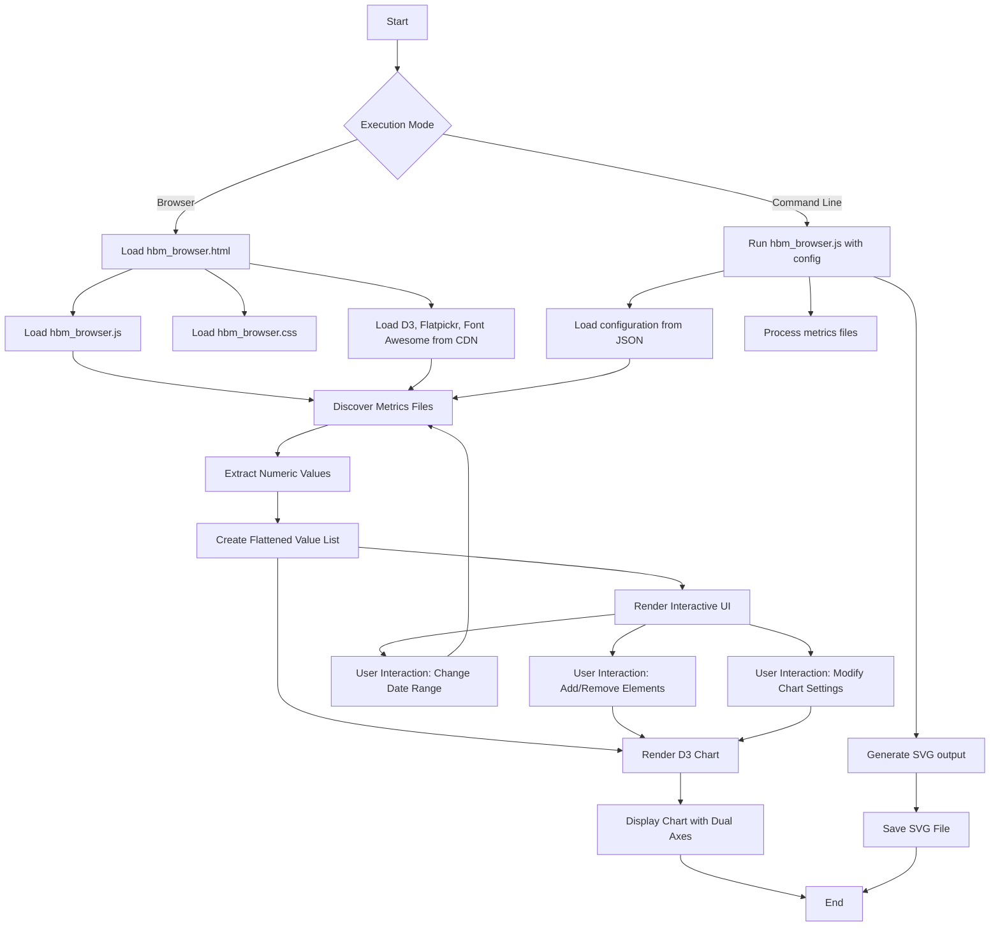
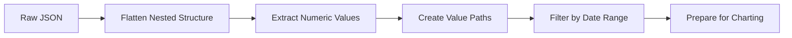

# Hydrogen Build Metrics Browser Architecture

## System Overview

## Component Details

### 1. File Discovery System

- **Local Mode**: `/docs/H/metrics/{year-month}/{year-month-day}.json`
- **GitHub Mode**: `https://github.com/500Foods/Philement/docs/H/metrics/{year-month}/{year-month-day}.json`
- **Fallback Logic**: Try today's date, then go back day-by-day until file is found

### 2. Data Processing Pipeline

### 3. Chart Configuration

- **Dual Axes**: Left/Right axis selection per metric
- **Chart Types**: Line/Bar selection per metric
- **Styling**: Color, label, and legend customization
- **Date Range**: Configurable start/end dates

### 4. User Interface Components

- **Main Chart Area**: Full-window SVG display
- **Control Panel**: Add/remove metrics, modify settings
- **Date Pickers**: Flatpickr for start/end date selection
- **Color Picker**: Simple JS color picker integration

### 5. Command Line Interface

- **Input**: Configuration JSON file path
- **Output**: SVG file path
- **Processing**: Headless chart generation