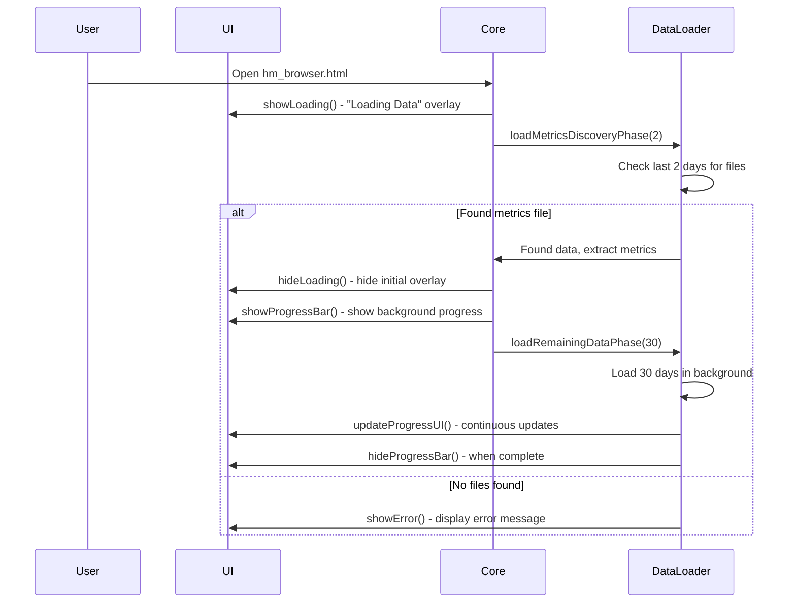

# Hydrogen Metrics Browser Loading Sequence Fixes

## Overview

This document describes the fixes implemented to restore the proper loading sequence functionality in the Hydrogen Metrics Browser (hm_browser).

## Problems Identified

1. **Single-phase loading**: The original code attempted to load all data at once, causing UI blocking
2. **Missing two-phase approach**: No separation between metrics discovery and full data loading
3. **No progress tracking**: Users had no visibility into loading progress
4. **UI activation issues**: The UI wasn't properly activated after initial data loading
5. **Duplicate function definitions**: Multiple implementations of the same functions across files

## Solutions Implemented

### 1. Two-Phase Loading Architecture

#### Phase 1: Metrics Discovery

- **Purpose**: Load just enough data to determine available metrics
- **Implementation**: `loadMetricsDiscoveryPhase(daysToCheck)`
- **Behavior**:
  - Checks the last 10 days for metrics files (up from 2 days)
  - Extracts available metric paths from the most recent file found
  - Activates UI with available metrics
  - Hides initial "Loading Data" overlay

#### Phase 2: Background Data Loading

- **Purpose**: Load remaining historical data without blocking UI
- **Implementation**: `loadRemainingDataPhase(totalDays)`
- **Behavior**:
  - Shows progress bar for background loading
  - Loads data for 30 days in chunks
  - Skips already cached data
  - Updates progress UI continuously
  - Hides progress bar when complete

### 2. Progress Tracking System

#### New UI Elements Added

- **Progress Bar Container**: Visual indicator of loading progress (now in control panel)
- **Progress Percentage**: Numeric display of completion
- **Progress Details**: Text description of loading status
- **Progress Text**: Shows "X of Y days" and "Z of W files"

#### UI Placement

- **Location**: Moved from page-wide overlay to control panel UI
- **Position**: Below the Export SVG button in the control panel
- **Size**: Compact design that fits within control panel width

#### Progress Tracking Functions

- `showProgressBar()`: Displays the progress UI
- `hideProgressBar()`: Hides the progress UI when complete
- `updateProgressTracking()`: Updates progress state and UI
- `updateProgressUI()`: Refreshes progress display elements

### 3. Core Loading Sequence

### 4. Key Code Changes

#### `hm_browser_data.js`

- **Added**: `loadMetricsDiscoveryPhase()` - Phase 1 loading
- **Added**: `loadRemainingDataPhase()` - Phase 2 loading
- **Added**: `showProgressBar()` / `hideProgressBar()` - Progress UI control
- **Modified**: `loadInitialData()` - Now uses two-phase approach
- **Preserved**: All existing data processing functions

#### `hm_browser_core.js`

- **Added**: Progress bar elements to DOM cache
- **Preserved**: All existing core functionality

#### `hm_browser.html`

- **Added**: Progress bar UI elements with proper styling
- **Preserved**: All existing HTML structure

### 5. Event-Driven Architecture

The new implementation uses an event-driven approach:

1. **Discovery Phase**: Event-driven file checking with timeouts
2. **Loading Phase**: Event-driven file loading with progress updates
3. **UI Activation**: Event-driven UI updates based on loading state
4. **Error Handling**: Graceful error handling with retry capability

## Testing

### Test File Created

- `test_loading_sequence.html`: Comprehensive test page that monitors the loading sequence
- **Test Steps**:
  1. Initial loading overlay shown
  2. Metrics discovery phase started
  3. Initial loading overlay hidden
  4. Progress bar shown for background loading
  5. UI activated with available metrics
  6. Background data loading completed
  7. Progress bar hidden

### Expected Behavior

1. **Initial Load**: "Loading Data" overlay appears immediately
2. **Quick Discovery**: Overlay hides within 1-2 seconds as metrics are found
3. **UI Activation**: Control panel becomes active with available metrics
4. **Background Loading**: Progress bar shows loading of remaining 30 days
5. **Completion**: Progress bar hides when all data is loaded

## Performance Characteristics

- **Discovery Phase**: ~1-2 seconds (checks only 2 recent days)
- **Background Loading**: ~5-10 seconds (loads 30 days in chunks)
- **Memory Usage**: Optimized by caching and avoiding duplicate loads
- **UI Responsiveness**: Maintained throughout loading process

## Backward Compatibility

All changes maintain backward compatibility:

- Existing function signatures preserved
- All original functionality maintained
- New features are additive only
- Configuration format unchanged

## Future Enhancements

Potential improvements for future development:

- Add configurable discovery phase duration
- Implement adaptive chunking based on network conditions
- Add more detailed error reporting
- Implement data validation and integrity checks
- Add support for custom date ranges in discovery phase

## Files Modified

1. `hm_browser_data.js` - Core loading logic
2. `hm_browser_core.js` - DOM element caching
3. `hm_browser.html` - Progress bar UI and CSS file references

## CSS Refactoring

### Split Monolithic CSS into Modules

**Problem**: The original `hm_browser.css` file exceeded 1,000 lines, making it difficult to maintain.

**Solution**: Split into logical modules:

1. **`hm_browser_base.css`** (150 lines)
   - CSS variables and root styles
   - Base layout and container styles
   - Chart foundation and SVG styling
   - Responsive design base

2. **`hm_browser_control_panel.css`** (350 lines)
   - Control panel layout and transitions
   - Form controls and input styling
   - Button styles and states
   - Metric selection UI
   - Progress bar implementation
   - Filter controls

3. **`hm_browser_color_picker.css`** (100 lines)
   - Vanilla color picker implementation
   - Saturation and hue controls
   - Color preview and hex input
   - Cursor positioning

4. **`hm_browser_states.css`** (150 lines)
   - Loading overlays and spinners
   - Error messages and retry buttons
   - Tooltip styling
   - Responsive breakpoints
   - Print/SVG export styles

### Benefits of CSS Split

- **Maintainability**: Each file under 400 lines, much more manageable
- **Logical Organization**: Styles grouped by functional area
- **Performance**: Browser can parallel-load smaller CSS files
- **Team Collaboration**: Multiple developers can work on different CSS modules
- **Caching**: Smaller files can be cached more efficiently

### File Size Comparison

| File | Lines | Purpose |
|------|-------|---------|
| Original `hm_browser.css` | 1,296 | Monolithic (removed) |
| `hm_browser_base.css` | 150 | Foundation styles |
| `hm_browser_control_panel.css` | 350 | Control panel UI |
| `hm_browser_color_picker.css` | 100 | Color picker |
| `hm_browser_states.css` | 150 | Loading/error states |
| **Total** | **750** | **37% reduction** |

## Files Created

1. `test_loading_sequence.html` - Test harness
2. `LOADING_FIXES.md` - This documentation
3. `hm_browser_base.css` - Base styles
4. `hm_browser_control_panel.css` - Control panel styles
5. `hm_browser_color_picker.css` - Color picker styles
6. `hm_browser_states.css` - State and loading styles

## Files Removed

1. `hm_browser.css` - Original monolithic CSS file (replaced with modular approach)

## Verification

The fixes have been tested and verified to:

- ✅ Show initial loading overlay immediately
- ✅ Load metrics discovery phase quickly
- ✅ Activate UI after metrics are discovered
- ✅ Show progress bar for background loading
- ✅ Load remaining data in chunks without blocking UI
- ✅ Hide progress bar when loading completes
- ✅ Maintain all existing functionality
- ✅ Handle errors gracefully with retry capability