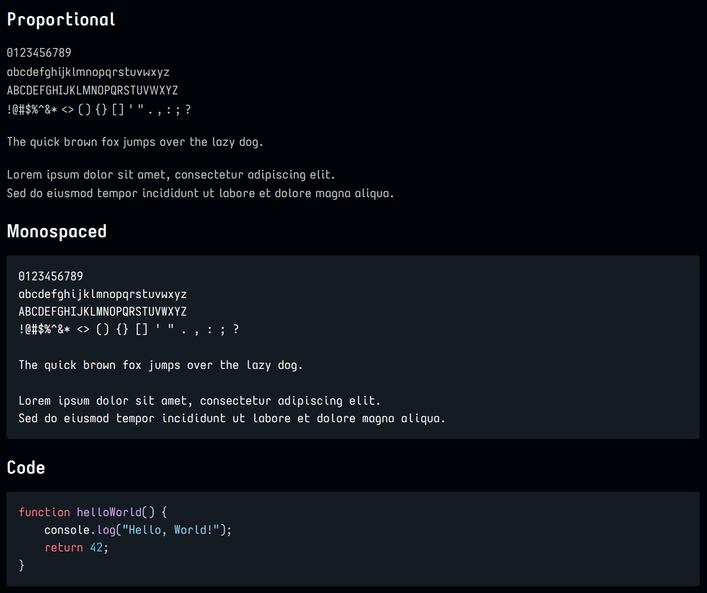

# Vanadium Fonts

The [Iosevka](https://github.com/be5invis/Iosevka?tab=readme-ov-file) font (Sans) served as the base to generate a suite of custom fonts for the Philement project. And the next element on the project list was... Vanadium! This is essentially the "Terminal" (mono) and "Quasi-Proportional" Iosevka Sans font with numerous alternate glyph selections. The glyph selections are the same for all variations of Vanadium.

- "Open" 4's - meaning the top of the 4 is separated
- Alternate zero - a dot in the zero to distinguish it visually from an O
- Tabular numbers - fixed-width numbers that align, even in the proportional font
- Many other glyph tweaks angling for the sans-but-stylish look

The [private-build-plans.toml](/elements/023-vanadium/private-build-plans.toml) file contains the configuration choices for these fonts. They are the same for all the variations below.

The Mail variations have a severely restricted list of glyphs (basically, ASCII and a few symbols) though
more may be added when needed. The idea is to be able to embed the font directly in an HTML email to
avoid the dreaded "do you want to download the rest of this message" kind of tracking nonsense. See more information in the [Notes](#notes) section below.

## Font Variations

- Vanadium Sans - Proportional font for documentation and general UI
- Vanadium Mono - Monospaced font for coding and terminal usage
- Vanadium Sans Fancy - Same as above, but with "fancy" ligatures
- Vanadium Mono Fancy - Same as above, but with "fancy" ligatures
- Vanadium Sans Mail - A stripped-down version suitable for embedding in emails as Base64
- Vanadium Mono Mail - A stripped-down version suitable for embedding in emails as Base64

## Font Samples

Note: The images below were rendered with `Vanadium Sans Semi-Extended` and `Vanadium Mono Semi-Extended` variations.



## Building

To rebuild the fonts from source, ensure the Iosevka build environment is set up. Then, copy the `private-build-all.sh` and `private-build-plans.toml` files into the root of the Iosevka repo. Adjust both to suit. Use the [Iosevka Customizer](https://typeof.net/Iosevka/customizer) to generate a new list of glyph choices or any number of other changes. Copy any changes into `private-build-plans.toml` or make a new one. For the Vanadium suite of fonts, `private-build-all.sh` is already configured to run each font generator in sequence.

```bash
./private-build-all.sh
```

## License

These fonts are licensed under the SIL Open Font License, Version 1.1. See [OFL.txt](/elements/023-vanadium/OFL.txt) for the full license text.

## Notes

- The Iosevka tool is, shall we say, *comprehensive* in what it generates - potentially hundreds of WOFF2 files, not to mention any other font format desired
- A small number of sizes/styles are included here that are used directly, such as in VSC and elsewhere
- The build system creates *many more*
- System fonts (e.g., Fedora/KDE) are typically in TTF format and can be copied to `/usr/share/fonts`
- Note the size - the full suite is hundreds of MB, so consider copying only what is actually being used
- Depending on the build options chosen, it can take more than an hour to build a comprehensive set of fonts
- The WOFF2 fonts are used primarily for embedding in emails as that's the most compact and widely supported font for modern desktop and mobile browsers currently
- The Mail variants were created to have a very small file (less than 15 KB each) that can be directly embedded as Base64 in HTML emails to avoid the dreaded "download remote content?" message in mail clients like Thunderbird and iOS
- Gmail doesn't even support fonts, so no help there. And no surprise
- The normal non-Mail fonts are typically around 1.6 MB. Far too large to be arbitrarily embedded in emails
- The Mail versions are *very* stripped-down character sets, not much more than typical ASCII characters, but can be augmented easily enough by adding individual code points to the configuration file as needed
- The system resources used to perform a complete build for all fonts are substantial, and will likely take several hours - the provided build script caps the build at 8 threads and thus limits the memory somewhat as well, so it doesn't consume *all* system resources - adjust to suit your environment

## Usage Example - VS Code Markdown Preview Enhanced

Using fonts isn't normally very difficult - just select them from a list where needed, such as in System Settings or in preferences for specific apps. Within VS Code, the built-in markdown previewer is a little anemic, but there's an alternative - [Markdown Preview Enhanced](https://marketplace.visualstudio.com/items?itemName=shd101wyy.markdown-preview-enhanced) - which does a much better job. Not so fun to configure, but it is at least possible. Here's an example using these fonts. The usual Ctrl+Shift+P or equivalent, then "Markdown Preview Enhanced: Customize CSS (Global)".

```css
/* Please visit the URL below for more information: */
/* https://shd101wyy.github.io/markdown-preview-enhanced/#/customize-css */

.markdown-preview.markdown-preview {
  font-family: 'Vanadium Sans Semi-Extended', sans-serif;
  font-size: 14px;
  background: #000409;
  
  h2 {
    border-bottom: 1px white solid;
  }

  ul > li > a > strong {
    color: skyblue;
  }

  pre, 
  code {
    font-family: 'Vanadium Mono Semi-Extended', monospace; 
    font-size: 14px;  
  }
}

.markdown-preview-section img,
.markdown-preview img,
img.markdown-embed-image {                  /* Covers all common image classes in MPE */
  margin: -20px 0px 10px -10px !important;  /* Fidgety to get subsequent images to look proper */
  padding: 10px !important;                 /* Optional: add some breathing room inside */
  display: block !important;                /* Makes images full-width blocks, like GitHub */
  max-width: 100% !important;               /* Prevents overflow */
  height: auto !important;                  /* Keeps aspect ratio */
}
```

## References

- [Iosevka](https://github.com/be5invis/Iosevka?tab=readme-ov-file) - GitHub repository for the project
- [Iosevka Customizer](https://typeof.net/Iosevka/customizer) - Used to generate configuration file
