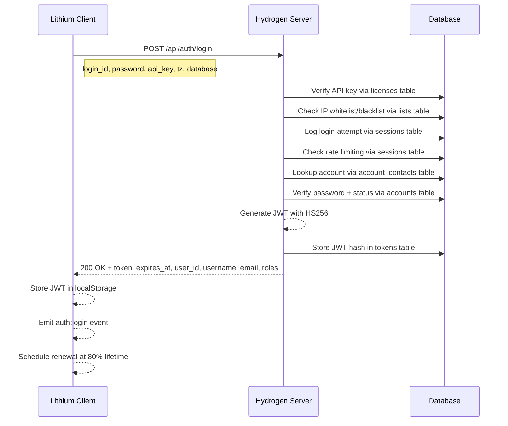
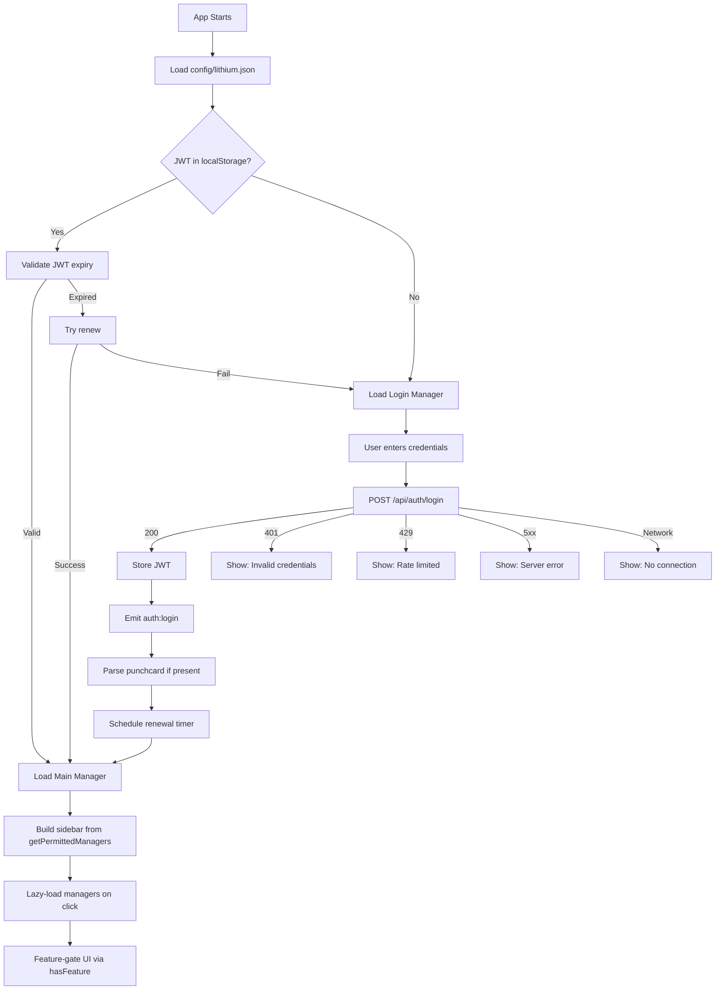

# Lithium Login & Authentication Planning

## Context

Lithium needs to authenticate against a database that mirrors the Acuranzo schema.
The user will create the database; it will initially be identical to Acuranzo in
structure and schema. This plan covers what needs to happen on both the testing side
and the implementation side — understanding the auth endpoints, processing the login,
and what changes might be needed in Hydrogen for features like Punchcard.

---

## 1. Current Auth Architecture

### 1.1 Hydrogen Auth Endpoints

| Endpoint | Method | Request Body | Auth Header | Response |
|----------|--------|-------------|-------------|----------|
| `/api/auth/login` | POST | `login_id, password, api_key, tz, database` | None | `token, expires_at, user_id, username, email, roles` |
| `/api/auth/renew` | POST | `{}` | `Bearer <token>` | `token, expires_at` |
| `/api/auth/logout` | POST | `{}` | `Bearer <token>` | `success` |
| `/api/auth/register` | POST | `username, password, email, full_name, api_key, database` | None | `user_id` |

### 1.2 Login Flow

### 1.3 JWT Claims Structure

Currently generated by Hydrogen:

| Claim | Type | Description |
|-------|------|-------------|
| `iss` | string | Always `hydrogen-auth` |
| `sub` | string | User ID as string |
| `aud` | string | App ID as string |
| `exp` | number | Expiration timestamp, 1 hour from issue |
| `iat` | number | Issued-at timestamp |
| `nbf` | number | Not-before timestamp |
| `jti` | string | Unique token ID, random base64url |
| `user_id` | number | Account ID |
| `system_id` | number | System ID from license/API key |
| `app_id` | number | Application ID from license |
| `username` | string | Account username |
| `email` | string | Account email |
| `roles` | string | JSON string of roles |
| `ip` | string | Client IP at login time |
| `tz` | string | Client timezone, e.g. America/Vancouver |
| `tzoffset` | number | UTC offset in minutes, e.g. -480 |
| `database` | string | Database name used for login |

**Not yet in JWT:** `lang` - preferred language, `punchcard` - permission matrix

### 1.4 Acuranzo Database Tables Involved in Auth

| Table | Role in Auth |
|-------|-------------|
| `accounts` | User records: account_id, name, password_hash, status, timezone |
| `account_contacts` | Login identifiers: username, email with contact_type and authenticate flags |
| `account_access` | Access control entries for accounts |
| `account_roles` | Role assignments per account |
| `licenses` | API key validation: app_key, system_id, expiry |
| `lists` | IP whitelist/blacklist entries |
| `sessions` | Login attempt audit log, failed attempt tracking |
| `tokens` | JWT hash storage for validation and revocation |
| `roles` | Role definitions |

---

## 2. New Database Setup

Since the new database will be identical to Acuranzo to start:

- All 23+ schema tables from migrations 1000-1023 will exist
- Lookup data from migrations 1024-1091 will provide reference data
- Auth query references from migrations 1092-1113 define the SQL queries Hydrogen uses
- Test accounts from migration 1144 and API keys from 1145 provide demo data

### Key Considerations

- The `database` field in the login request routes to the correct database connection
- Lithium config `auth.default_database` must match the Hydrogen connection name
- The `api_key` in Lithium config must exist in the `licenses` table
- Environment variables control demo credentials: `HYDROGEN_DEMO_USER_NAME`, `HYDROGEN_DEMO_USER_PASS`, `HYDROGEN_DEMO_API_KEY`

---

## 3. What Needs to Happen

### 3.1 Lithium Testing Side

#### Integration Tests for Login Flow

The current Lithium tests are all unit tests. Login flow testing needs integration
tests that mock the Hydrogen API responses.

**Tests needed:**

1. **Login success flow** — Mock `POST /api/auth/login` returning 200 with token;
   verify JWT is stored, `auth:login` event fires, login page fades out
2. **Login failure flows** — Mock 401, 429, 500 responses; verify correct error
   messages display, password field clears on 401, rate limit countdown on 429
3. **Token renewal flow** — Mock `POST /api/auth/renew` returning new token;
   verify token is replaced in localStorage, `auth:renewed` event fires
4. **Logout flow** — Mock `POST /api/auth/logout`; verify token cleared,
   `auth:logout` event fires, login page returns
5. **Expired token handling** — Verify `auth:expired` event fires when validation
   fails, app redirects to login
6. **Login with punchcard** — When punchcard lands in JWT, verify
   `parsePermissions()` correctly extracts manager/feature access

#### Test Approach

- Use Vitest with `vi.fn()` to mock `fetch()` calls
- Create helper factory functions for mock JWT tokens with various claim sets
- Test the full LoginManager lifecycle: init → render → submit → success/failure
- Test json-request.js auth header attachment and renewal scheduling

### 3.2 Lithium Implementation Side

#### Config Changes

- Update `lithium.json` default_database to match new database name
- Ensure `api_key` matches a valid `licenses.app_key` entry in the new database

#### Punchcard Integration

The BLUEPRINT already has `permissions.js` structured for punchcard, but the JWT
doesn't include punchcard claims yet. When it does:

1. **JWT decode** — `jwt.js` already decodes arbitrary claims, so `punchcard` will
   be accessible via `getClaims(token).punchcard`
2. **Permissions parsing** — `permissions.js` has `parsePermissions(claims)` which
   looks for `claims.punchcard`; currently falls back to allow-all when missing
3. **Menu generation** — `main.js` calls `getPermittedManagers()` to build sidebar;
   will automatically filter when punchcard is present
4. **Feature gating** — Style Manager already calls `hasFeature()` for edit/delete
   buttons; other managers should follow this pattern

### 3.3 Hydrogen Side Changes Needed

#### Punchcard in JWT - Medium Priority

To include punchcard in the JWT, Hydrogen needs:

1. **New query ref** — A query to fetch punchcard data for an account/role
   combination from the `account_access` table
2. **JWT generation change** — Add `punchcard` claim to the payload in
   `generate_jwt()` and `generate_new_jwt()` in `auth_service_jwt.c`
3. **JWT claims struct** — Add `char* punchcard` field to `jwt_claims_t`
4. **Migration** — New acuranzo migration to define the punchcard query
5. **Test update** — Update `test_40_auth.sh` to verify punchcard claim presence

#### Lang in JWT - Lower Priority

Similar pattern: add `lang` claim sourced from account preferences.

---

## 4. Auth Flow Diagram - Lithium Perspective

---

## 5. Test Matrix - What Hydrogen Tests Already Cover

The existing `test_40_auth.sh` tests across 7 database engines:

| Test | Endpoint | Expected |
|------|----------|----------|
| Login with valid credentials | POST /api/auth/login | 200 + JWT |
| Login with invalid password | POST /api/auth/login | 401 |
| Token renewal | POST /api/auth/renew | 200 + new JWT |
| Logout | POST /api/auth/logout | 200 |
| Registration | POST /api/auth/register | 201 |

**Not yet tested in Hydrogen:**

- Punchcard claim inclusion in JWT
- Lang claim inclusion in JWT
- Disabled account login attempt → 403
- Expired API key login attempt → 403
- IP blacklist blocking → 403
- Rate limiting triggering → 429

---

## 6. Task Breakdown

### Database Setup - by user

- [ ] Create new database with Acuranzo-identical schema
- [ ] Ensure migrations run through at least 1145 for test accounts/API keys
- [ ] Configure Hydrogen connection to new database
- [ ] Update Lithium config with correct database name and API key

### Lithium Integration Tests

- [ ] Create test helper: mock JWT token factory with configurable claims
- [ ] Create test helper: mock fetch responses for each auth endpoint
- [ ] Write LoginManager integration test: success flow
- [ ] Write LoginManager integration test: error flows - 401, 429, 500, network
- [ ] Write token renewal integration test
- [ ] Write logout flow integration test
- [ ] Write expired token detection test
- [ ] Write punchcard-aware permission test when punchcard is in claims

### Lithium Config Updates

- [ ] Update lithium.json default_database to match new database
- [ ] Update lithium.json api_key to match licenses table entry
- [ ] Verify login works end-to-end against new database

### Hydrogen Punchcard Changes - future

- [ ] Design punchcard data model: which tables, what format
- [ ] Create migration for punchcard query ref
- [ ] Update jwt_claims_t struct with punchcard field
- [ ] Update generate_jwt to include punchcard claim
- [ ] Update generate_new_jwt to preserve punchcard on renewal
- [ ] Update validate_jwt to extract punchcard
- [ ] Update test_40_auth.sh to verify punchcard in token
- [ ] Update Lithium permissions tests for real punchcard data
